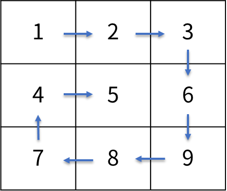
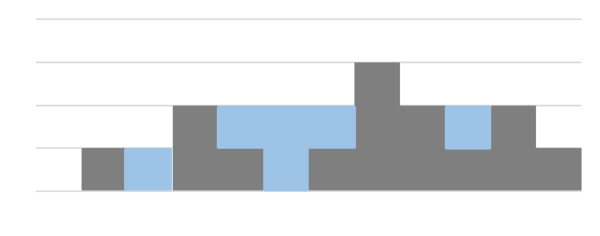

# Table of Contents
|           Problem #[^1]           | Origin | Description |
| :-------------------------------: | :----: | :---------: |
| [1. 1. 18_1. 1](#practice-111811) | [leetcode](https://leetcode.com/problems/reverse-integer/)                                          | 정수 역순으로 뒤집기 |
| [1. 1. 18_1. 2](#practice-111812) | unknown                                                                                             | 대소문자 변경 |
| [1. 1. 18_1. 3](#practice-111813) | unknown                                                                                             | String.replace() 구현 |
| [1. 1. 18_1. 4](#practice-111814) | acmicpc<br>[2](https://www.acmicpc.net/problem/2438) [3](https://www.acmicpc.net/problem/2439) [4](https://www.acmicpc.net/problem/2442) [5](https://www.acmicpc.net/problem/2444) | asterisk 프린트 |
| [1. 1. 18_1. 5](#practice-111815) | [leetcode](https://leetcode.com/problems/container-with-most-water/)                                | 저수량이 최대가 되는 벽 고르기 |
| [1. 1. 18_2. 1](#practice-111821) | [leetcode](https://leetcode.com/problems/roman-to-integer/)                                         | 로마 숫자 → Integer |
| [1. 1. 18_2. 2](#practice-111822) | [leetcode](https://leetcode.com/problems/integer-to-roman/)                                         | Integer → 로마 숫자 |
| [1. 1. 18_2. 3](#practice-111823) | [acmicpc](https://www.acmicpc.net/problem/1406)                                                     | 간단한 에디터 구현 |
| [1. 1. 18_2. 4](#practice-111824) | unknown                                                                                             | ASCII → String |
| [1. 1. 18_2. 5](#practice-111825) | [leetcode](https://leetcode.com/problems/candy/)                                                    | 사탕 나눠주기 |
| [1. 1. 18_3. 1](#practice-111831) | [leetcode](https://leetcode.com/problems/remove-duplicates-from-sorted-array/)                      | 정렬된 배열에서 중복제거 |
| [1. 1. 18_3. 2](#practice-111832) | [leetcode](https://leetcode.com/problems/find-all-duplicates-in-an-array/)                          | 배열에서 두 번 나타나는 정수들 반환 |
| [1. 1. 18_3. 3](#practice-111833) | [leetcode](https://leetcode.com/problems/find-k-closest-elements/)                                  | 배열에서 절대값 가까운 수 k개 출력 (작은 수 우선) |
| [1. 1. 18_3. 4](#practice-111834) | [leetcode](https://leetcode.com/problems/spiral-matrix/)                                            | 2D 배열 나선형 방향 출력 |
| [1. 1. 18_3. 5](#practice-111835) | [leetcode](https://leetcode.com/problems/trapping-rain-water/)                                      | 벽 사이 총 저수량 |
| [2. 1. 09_1. 1](#practice-210911) | [leetcode](https://leetcode.com/problems/pascals-triangle/)                                         | 파스칼 삼각형 출력 |
| [2. 1. 09_1. 2](#practice-210912) | [leetcode](https://leetcode.com/problems/previous-permutation-with-one-swap/)                       | 한자리 정수 배열, 현배열 다음으로 큰 수 구하기 (1스왑) |
| [2. 1. 09_1. 3](#practice-210913) | [leetcode](https://leetcode.com/problems/permutation-in-string/)                                    | str1의 permutation이 str2에 포함되는지 판별 |
| [2. 1. 09_1. 4](#practice-210914) | [leetcode](https://leetcode.com/problems/happy-number/)                                             | [Happy Number](https://en.wikipedia.org/wiki/Happy_number) |
| [2. 1. 09_1. 5](#practice-210915) | [leetcode](https://leetcode.com/problems/island-perimeter/)                                         | 해안선 길이 구하기 |
| [2. 1. 09_2. 1](#practice-210921) | [leetcode](https://leetcode.com/problems/unique-binary-search-trees/)                               | [Catalan Number](https://en.wikipedia.org/wiki/Catalan_number) |
| [2. 1. 09_2. 2](#practice-210922) | [acmicpc](https://www.acmicpc.net/problem/17609)                                                    | palindrome / pseudopalindrome[^4] |
| [2. 1. 09_2. 3](#practice-210923) | [leetcode](https://leetcode.com/problems/solve-the-equation/)                                       | +-만 있는 1차 방정식 풀이 |
| [2. 1. 09_2. 4](#practice-210924) | [leetcode](https://leetcode.com/problems/count-good-numbers/)                                       | 짝수 인덱스에는 짝수, 홀수 인덱스에는 소수인 숫자 갯수 |
| [2. 1. 09_2. 5](#practice-210925) | [acmicpc](https://www.acmicpc.net/problem/1914)                                                     | 하노이의 탑 |
| [2. 2. 03_1. 1](#practice-220311) | unknown                                                                                             |   |
| [2. 2. 03_1. 2](#practice-220312) | unknown                                                                                             |   |
| [2. 2. 03_1. 3](#practice-220313) | unknown                                                                                             |   |
| [2. 2. 03_1. 4](#practice-220314) | unknown                                                                                             |   |
| [2. 2. 03_1. 5](#practice-220315) | unknown                                                                                             |   |
| [2. 2. 03_1. 6](#practice-220316) | [leetcode](https://leetcode.com/problems/rotate-image/)                                             | 48. Rotate Image (not a 100% match) |
| [2. 2. 03_1. 7](#practice-220317) | unknown                                                                                             |   |
| [2. 2. 05_1. 1](#practice-220511) | [leetcode](https://leetcode.com/problems/remove-duplicates-from-an-unsorted-linked-list)            | 1836. Remove Duplicates From an Unsorted Linked List |
| [2. 2. 05_1. 2](#practice-220512) | [leetcode](https://leetcode.com/problems/palindrome-linked-list/)                                   | 234. Palindrome Linked List |
| [2. 2. 05_1. 3](#practice-220513) | [leetcode](https://leetcode.com/problems/reverse-linked-list-ii/)                                   | 92. Reverse Linked List II |
| [2. 2. 07_1. 1](#practice-220711) | [leetcode](https://leetcode.com/problems/reverse-string/)                                           | 344. Reverse String |
| [2. 2. 07_1. 2](#practice-220712) | [acmicpc](https://www.acmicpc.net/problem/9012)                                                     | 9012. 괄호 |
| [2. 2. 07_1. 3](#practice-220713) | [acmicpc](https://www.acmicpc.net/problem/1935)                                                     | 1935. 후위 표기식2 |
| [2. 2. 07_1. 4](#practice-220714) | [leetcode](https://leetcode.com/problems/backspace-string-compare/)                                 | 844. Backspace String Compare |
| [2. 2. 09_1. 1](#practice-220911) | [acmicpc](https://www.acmicpc.net/problem/2164)                                                     | 2164. 카드2 |
| [2. 2. 09_1. 2](#practice-220912) | [acmicpc](https://www.acmicpc.net/problem/1158)                                                     | 1158. 요세푸스 문제 |
| [2. 2. 11_1. 1](#practice-221111) | [leetcode](https://leetcode.com/problems/reorder-list/)                                             | 143. Reorder List |
| [2. 2. 11_1. 2](#practice-221112) | [leetcode](https://leetcode.com/problems/valid-palindrome/)                                         | 125. Valid Palindrome |
| [2. 2. 11_1. 3](#practice-221113) | unknown                                                                                             |   |
| [2. 2. 11_1. 4](#practice-221114) | unknown                                                                                             |   |
| [2. 2. 13_1. 1](#practice-221311) | unknown                                                                                             |   |
| [2. 2. 13_1. 2](#practice-221312) | [leetcode](https://leetcode.com/problems/two-sum/)                                                  | 1. Two Sum (not a 100% match) |
| [2. 2. 13_1. 3](#practice-221313) | unknown                                                                                             |   |
| [2. 2. 14_1. 1](#practice-221421) | unknown                                                                                             | 주어진 코드에 의해 변형된 배열을 원배열로 되돌리기 |
| [2. 2. 14_1. 2](#practice-221412) | [leetcode](https://leetcode.com/problems/set-matrix-zeroes/)                                        | 2D 배열에서 0이 있는 행과 열을 0으로 변경 |
| [2. 2. 14_1. 3](#practice-221413) | [acmicpc](https://www.acmicpc.net/problem/2346)                                                     | 풍선 터뜨리는 순서 |
| [2. 2. 14_1. 4](#practice-221414) | [leetcode](https://leetcode.com/problems/valid-parentheses/)                                        | 괄호 정상여부 판정 |
| [2. 2. 14_1. 5](#practice-221415) | [acmicpc](https://www.acmicpc.net/problem/3190)                                                     | Snake 게임 종료시점 계산 |
| [2. 2. 14_2. 1](#practice-221421) | [programmers](https://programmers.co.kr/learn/courses/30/lessons/42587)                             | 문서 중요도순 출력 |
| [2. 2. 14_2. 2](#practice-221422) | [acmicpc](https://www.acmicpc.net/problem/1874)                                                     | stack으로 특정 수열 만들기 |
| [2. 2. 14_2. 3](#practice-221423) | [programmers](https://programmers.co.kr/learn/courses/30/lessons/42579)                             | 장르카운트 → 고유카운트 → uid 순서 정렬 (장르별 2개) |
| [2. 2. 14_2. 4](#practice-221424) | [programmers](https://programmers.co.kr/learn/courses/30/lessons/42576)                             | p배열 중 c배열에 포함되지 않은 요소 구하기 (중복可) |
| [2. 2. 14_2. 5](#practice-221425) | [programmers](https://programmers.co.kr/learn/courses/30/lessons/67258)                             | 배열상 요소를 한 종류씩 포함하는 최단 구간 |
| [2. 3. 02_1. 1](#practice-230211) | [acmicpc](https://www.acmicpc.net/problem/1802)                                                     | 1802. 종이 접기 (not a 100% match) |
| [2. 3. 02_1. 2](#practice-230212) | [acmicpc](https://www.acmicpc.net/problem/13325)                                                    | 13325. 이진 트리 |
| [2. 3. 04_1. 1](#practice-230411) | [leetcode](https://leetcode.com/problems/kth-smallest-element-in-a-bst/)                            | 230. Kth Smallest Element in a BST |
| [2. 3. 04_1. 2](#practice-230412) | [leetcode](https://leetcode.com/problems/minimum-absolute-difference-in-bst/)                       | 530. Minimum Absolute Difference in BST |
| [2. 3. 04_1. 3](#practice-230413) | [leetcode](https://leetcode.com/problems/two-sum-iv-input-is-a-bst/)                                | 653. Two Sum IV - Input is a BST |
| [2. 3. 06_1. 1](#practice-230611) | [leetcode](https://leetcode.com/problems/find-center-of-star-graph/)                                | 1791. Find Center of Star Graph |
| [2. 3. 06_1. 2](#practice-230612) | [leetcode](https://leetcode.com/problems/find-if-path-exists-in-graph/)                             | 1971. Find if Path Exists in Graph |
| [2. 3. 06_1. 3](#practice-230613) | [leetcode](https://leetcode.com/problems/is-graph-bipartite/)                                       | 785. Is Graph Bipartite? |
| [2. 3. 08_1. 1](#practice-230811) | unknown                                                                                             |   |
| [2. 3. 08_1. 2](#practice-230812) | [acmicpc](https://www.acmicpc.net/problem/1927)<br>[acmicpc](https://www.acmicpc.net/problem/11279) | 1927. 최소 힙<br>11279. 최대 힙 |
| [2. 3. 08_1. 3](#practice-230813) | unknown                                                                                             |   |
| [2. 3. 10_1. 1](#practice-231011) | [leetcode](https://leetcode.com/problems/kth-largest-element-in-an-array/)                          | 215. Kth Largest Element in an Array |
| [2. 3. 10_1. 2](#practice-231012) | [leetcode](https://leetcode.com/problems/last-stone-weight-ii/)                                     | 1049. Last Stone Weight II |
| [2. 3. 10_1. 3](#practice-231013) | [leetcode](https://leetcode.com/problems/top-k-frequent-elements/)                                  | 347. Top K Frequent Elements |
| [2. 3. 10_1. 4](#practice-231014) | [leetcode](https://leetcode.com/problems/reorganize-string/)                                        | 767. Reorganize String |
| [2. 3. 12_1. 1](#practice-231211) | [leetcode](https://leetcode.com/problems/counting-words-with-a-given-prefix/)                       | 2185. Counting Words With a Given Prefix (not a 100% match) |
| [2. 3. 12_1. 2](#practice-231212) | [leetcode](https://leetcode.com/problems/replace-words/)                                            | 648. Replace Words |
| [2. 3. 12_1. 3](#practice-231213) | unknown                                                                                             |   |
| [2. 3. 13_1. 1](#practice-231311) | [leetcode](https://leetcode.com/problems/word-search/)                                              | 2D array에서 문자열 찾기 |
| [2. 3. 13_1. 2](#practice-231312) | [leetcode](https://leetcode.com/problems/surrounded-regions/)                                       | 2D array에서 x로 둘러싸인 부분 찾기 |
| [2. 3. 13_1. 3](#practice-231313) | [leetcode](https://leetcode.com/problems/accounts-merge/)                                           | 중복 이메일 병합 (동명이인 존재) |
| [2. 3. 13_1. 4](#practice-231314) | [leetcode](https://leetcode.com/problems/open-the-lock/)                                            | 4 digit combination padlock 회전수 계산 |
| [2. 3. 13_1. 5](#practice-231315) | [leetcode](https://leetcode.com/problems/minimum-jumps-to-reach-home/)                              | 1D 로봇 이동횟수 계산 |
| [2. 3. 13_2. 1](#practice-231321) | [leetcode](https://leetcode.com/problems/the-number-of-the-smallest-unoccupied-chair/)              | 가장 낮은 번호 의자에 앉기 |
| [2. 3. 13_2. 2](#practice-231322) | [leetcode](https://leetcode.com/problems/minimum-interval-to-include-each-query/)                   | 각 쿼리를 포함하는 최소구간 |
| [2. 3. 13_2. 3](#practice-231323) | [leetcode](https://leetcode.com/problems/construct-target-array-with-multiple-sums/)                | 초기 배열을 타겟 배열로 변형 가부 |
| [2. 3. 13_2. 4](#practice-231324) | [leetcode](https://leetcode.com/problems/maximum-performance-of-a-team/)                            | 팀 작업성능 최적화 |
| [2. 3. 13_2. 5](#practice-231325) | [leetcode](https://leetcode.com/problems/camelcase-matching/)                                       | 문자열+패턴으로 주어진 문자열들을 만들 수 있는지 판별 |
| [2. 3. 13_3. 1](#practice-231331) | [acmicpc](https://www.acmicpc.net/problem/10026)                                                    | 일반인과 색약자에게 보이는 구역수 판정 |
| [2. 3. 13_3. 2](#practice-231332) | unknown                                                                                             | 불을 켤 수 있는 방의 최대수 |
| [2. 3. 13_3. 3](#practice-231333) | [acmicpc](https://www.acmicpc.net/problem/17612)                                                    | 여러 계산대가 있을 때 계산 완료 순서 |
| [2. 3. 13_3. 4](#practice-231334) | [programmers](https://programmers.co.kr/learn/courses/30/lessons/42577)                             | 전화번호가 다른 전화번호의 접23두어인지 식별 |
| [2. 3. 13_3. 5](#practice-231335) | [acmicpc](https://www.acmicpc.net/problem/5670)                                                     | 자동완성 평균 타이핑 수 계산 |
| [2. 4. 03_1. 1](#practice-240311) | [leetcode](https://leetcode.com/problems/sort-colors/)                                              | 75. Sort Colors |
| [2. 4. 03_1. 2](#practice-240312) | [leetcode](https://leetcode.com/problems/group-anagrams/)                                           | 49. Group Anagrams |
| [2. 4. 03_1. 3](#practice-240313) | [leetcode](https://leetcode.com/problems/merge-intervals/)                                          | 56. Merge Intervals |
| [2. 4. 03_1. 4](#practice-240314) | [leetcode](https://leetcode.com/problems/shortest-unsorted-continuous-subarray/)                    | 581. Shortest Unsorted Continuous Subarray |
| [2. 4. 05_1. 1](#practice-240511) | [leetcode](https://leetcode.com/problems/binary-search/)                                            | 704. Binary Search (not a 100% match) |
| [2. 4. 05_1. 2](#practice-240512) | [leetcode](https://leetcode.com/problems/search-in-rotated-sorted-array/)                           | 33. Search in Rotated Sorted Array |
| [2. 4. 05_1. 3](#practice-240513) | [leetcode](https://leetcode.com/problems/search-a-2d-matrix/)                                       | 74. Search a 2D Matrix |
| [2. 4. 05_1. 4](#practice-240514) | [leetcode](https://leetcode.com/problems/capacity-to-ship-packages-within-d-days/)                  | 1011. Capacity To Ship Packages Within D Days |
| [2. 4. 05_1. 5](#practice-240515) | [leetcode](https://leetcode.com/problems/split-array-largest-sum/)                                  | 410. Split Array Largest Sum |
| [2. 4. 07_1. 1](#practice-240711) | unknown                                                                                             |   |
| [2. 4. 07_1. 2](#practice-240712) | [leetcode](https://leetcode.com/problems/intersection-of-two-arrays/)                               | 349. Intersection of Two Arrays |
| [2. 4. 07_1. 3](#practice-240713) | [leetcode](https://leetcode.com/problems/reverse-words-in-a-string/)                                | 151. Reverse Words in a String |
| [2. 4. 07_1. 4](#practice-240714) | [leetcode](https://leetcode.com/problems/3sum/)                                                     | 15. 3Sum |
| [2. 4. 09_1. 1](#practice-240911) | [leetcode](https://leetcode.com/problems/jump-game/)                                                | 55. Jump Game |
| [2. 4. 09_1. 2](#practice-240912) | [leetcode](https://leetcode.com/problems/best-time-to-buy-and-sell-stock-ii/)                       | 122. Best Time to Buy and Sell Stock II |
| [2. 4. 09_1. 3](#practice-240913) | unknown                                                                                             |   |
| [2. 4. 09_1. 4](#practice-240914) | [leetcode](https://leetcode.com/problems/gas-station/)                                              | 134. Gas Station |
| [2. 4. 09_1. 5](#practice-240915) | [leetcode](https://leetcode.com/problems/maximum-swap/)                                             | 670. Maximum Swap |
| [2. 4. 11_1. 1](#practice-241111) | [leetcode](https://leetcode.com/problems/maximum-subarray/)                                         | 53. Maximum Subarray |
| [2. 4. 11_1. 2](#practice-241112) | [leetcode](https://leetcode.com/problems/merge-k-sorted-lists/)                                     | 23. Merge k Sorted Lists |
| [2. 4. 13_1. 1](#practice-241311) | unknown                                                                                             |   |
| [2. 4. 13_1. 2](#practice-241312) | [leetcode](https://leetcode.com/problems/longest-continuous-increasing-subsequence/)                | 674. Longest Continuous Increasing Subsequence |
| [2. 4. 13_1. 3](#practice-241313) | [acmicpc](https://www.acmicpc.net/problem/12865)                                                    | 12865. 평범한 배낭 |
| [2. 4. 15_1. 1](#practice-241511) | [acmicpc](https://www.acmicpc.net/problem/15649)                                                    | 15649. N과 M (1) |
| [2. 4. 15_1. 2](#practice-241512) | [acmicpc](https://www.acmicpc.net/problem/2023)                                                     | 2023. 신기한 소수 |
| [2. 4. 15_1. 3](#practice-241513) | [acmicpc](https://www.acmicpc.net/problem/19949)                                                    | 19949. 영재의 시험 |
| [2. 4. 15_1. 4](#practice-241514) | [acmicpc](https://www.acmicpc.net/problem/16197)                                                    | 16197. 두 동전 |
| [2. 4. 17_1. 1](#practice-241711) | [acmicpc](https://www.acmicpc.net/problem/1504)                                                     | 1504. 특정한 최단 경로 |
| [2. 4. 17_1. 2](#practice-241712) | [acmicpc](https://www.acmicpc.net/problem/1865)                                                     | 1865. 웜홀 |
| [2. 4. 17_1. 3](#practice-241713) | [acmicpc](https://www.acmicpc.net/problem/11404)                                                    | 11404. 플로이드 |
| [2. 4. 19_1. 1](#practice-241911) | [acmicpc](https://www.acmicpc.net/problem/2887)                                                     | 2887. 행성 터널 |
| [2. 4. 19_1. 2](#practice-241912) | [acmicpc](https://www.acmicpc.net/problem/1647)                                                     | 1647. 도시 분할 계획 |
| [2. 4. 20_1. 1](#practice-242011) | [acmicpc](https://www.acmicpc.net/problem/3079)                                                     |   |
| [2. 4. 20_1. 2](#practice-242012) | [acmicpc](https://www.acmicpc.net/problem/15961)                                                    |   |
| [2. 4. 20_1. 3](#practice-242013) | [acmicpc](https://www.acmicpc.net/problem/1700)                                                     |   |
| [2. 4. 20_1. 4](#practice-242014) | [acmicpc](https://www.acmicpc.net/problem/2240)                                                     |   |
| [2. 4. 20_1. 5](#practice-242015) | [acmicpc](https://www.acmicpc.net/problem/13418)                                                    |   |
| [2. 4. 20_2. 1](#practice-242021) | [programmers](https://programmers.co.kr/learn/courses/30/lessons/43236)                             |   |
| [2. 4. 20_2. 2](#practice-242022) | unknown                                                                                             |   |
| [2. 4. 20_2. 3](#practice-242023) | [programmers](https://programmers.co.kr/learn/courses/30/lessons/42886)                             |   |
| [2. 4. 20_2. 4](#practice-242024) | [acmicpc](https://www.acmicpc.net/problem/4095)                                                     |   |
| [2. 4. 20_2. 5](#practice-242025) | [leetcode](https://leetcode.com/problems/min-cost-to-connect-all-points/)                           |   |

[^1]: Part. Chapter. Subchapter. Problem Number

# Part 01. Java 기초 연습문제
## Chapter 01. Java 프로그래밍
### Practice 111811
입력된 정수 자료형의 숫자를 거꾸로 변환하는 프로그램을 작성하세요.

- 예를들어 12345가 입력되면 54321로 변환하여 출력하면 된다.
- 100의 경우 001이 되는데 이 경우 1만 출력하도록 한다.


입출력 예시
---
|입력|결과|
|---|---|
|12345|54321|
|-12345|-54321|
|100|1|
|0|0|

---

### Practice 111812
아스키 코드는 미국정보교환표준부호를 의미한다.  

영어로 American Standard Code for Information Interchange 이며, 줄여서 ASCII 라고 한다.  

문자를 사용하는 대부분의 장치에서 사용하며 문자 인코딩 방식에 아스키를 기초로 두고 있다.

다음은 아스키의 특징이다.
- 7비트로 구성
- 총 128개의 문자로 구성 (출력 불가능한 제어문자 33개, 출력 가능한 문자 95개)
- 출력 가능한 문자들은 52개의 영문 알파벳 대소문자와, 10개의 숫자, 32개의 특수 문자, 1개의 공백 문자로 이루어진다.

이번 문제에서는 아스키 코드 중 알파벳에 대해서,  
사용자가 입력한 알파벳의 대소문자를 변경하는 프로그램을 작성하시오.


입출력 예시
---
|입력|결과|
|---|---|
|a|A|
|b|B|
|C|c|
|D|d|

---

### Practice 111813
자바의 String 자료형에는 많은 연산자 기능들이 있다.

프로그래밍의 기본기를 익히기 위해 일부 연산자들을 제한하고 다음의 기능을 구현하려 한다.
- String 의 replace 기능 구현
- String의 replace, indexOf, contains를 사용하지 않고 구현한다.


입출력 예시
---
|입력 문자열|from|to|출력|
|---|---|---|---|
|"Hello Java, Nice to meet you! Java is fun!"|"Java"|"자바"|"Hello 자바, Nice to meet you! 자바 is fun!"|
|POP|P|W|WOW|

---

### Practice 111814
여러가지 별찍기 연습을 해보자.  
반복문과 조건문의 연습에는 과연 별찍기 만한 것이 없다.

아래 5가지 별 찍기 타입이 있다.
- 아래 모양은 N (별 출력 행의 수)이 3일 떄의 출력 결과 들이다.

|타입|모양|
|---|---|
|1|*** <br> *** <br> ***|
|2|* <br> ** <br> ***|
|3|&nbsp;&nbsp;* <br> &nbsp;** <br> ***|
|4|&nbsp;&nbsp;* <br> &nbsp;*** <br> *****|
|5|&nbsp;&nbsp;* <br> &nbsp;*** <br> &nbsp;&nbsp;*|


별 출력 행의 수 N과 별 타입 T가 주어질 때 해당 별 모양을 출력하는 프로그램을 작성하세요.  
(N은 홀수)


입출력 예시
---
|N|T|출력|
|---|---|---|
|3|1|*** <br> *** <br> ***|
|3|2|* <br> ** <br> ***|
|3|3|&nbsp;&nbsp;* <br> &nbsp;** <br> ***|
|3|4|&nbsp;&nbsp;* <br> &nbsp;*** <br> *****|
|7|5|&nbsp;&nbsp;&nbsp;* <br> &nbsp;&nbsp;*** <br> &nbsp;***** <br> ******* <br> &nbsp;***** <br> &nbsp;&nbsp;*** <br> &nbsp;&nbsp;&nbsp;*|

---

### Practice 111815
n개의 데이터가 height 배열에 주어졌다.  
height 배열의 각각의 원소는 아래 그림과 같이 각 벽에 대한 높이를 의미한다.

이와 같이 높이 값들이 주어졌을 때,  
이 중에서 어떤 두 벽을 고르면 가장 많은 물을 담을 수 있는지를 확인하고  
그 때의 면적을 출력하세요.


입출력 예시
---
|입력|출력|
|---|---|
|1, 8, 6, 2, 5, 4, 8, 3, 7|49|
|5, 3, 9, 2, 1, 1, 1, 1, 1, 1, 1, 1, 1, 2|26|

---

### Practice 111821
로마 숫자 표기를 정수형으로 변환하는 프로그램을 작성하세요.

로마 숫자 표기법은 I, V, X, L, C, D, M 으로 이루어져있다.

|로마 숫자|정수형|
|---|---|
|I|1|
|V|5|
|X|10|
|L|50|
|C|100|
|D|500|
|M|1000|


로마 숫자 표기 방식
* 큰 기호에서 작은 기호 방향으로 작성 (XI, VI, II, ...)
* 다음의 경우 작은 기호가 큰 기호 앞에 올 수 있다.
  * I 는 V 와 X 의 앞에 올 수 있다. (IV: 4, IX: 9)
  * X 는 L 과 C 의 앞에 올 수 있다. (XL: 40, XC: 90)
  * C 는 D 와 M 의 앞에 올 수 있다. (CD: 400, CM: 900)


입출력 예시
---

|입력|출력|
|---|---|
|"III"|3|
|"IV"|4|
|"VI"|6|
|"XIII"|13|
|"XXVI"|26|
|"MCMXCIV"|1994|

---

### Practice 111822
정수형 숫자를 로마 숫자 표기로 변환하는 프로그램을 작성하세요.

로마 숫자 표기법은 I, V, X, L, C, D, M 으로 이루어져있다.

|로마 숫자|정수형|
|---|---|
|I|1|
|V|5|
|X|10|
|L|50|
|C|100|
|D|500|
|M|1000|


로마 숫자 표기 방식
* 큰 기호에서 작은 기호 방향으로 작성 (XI, VI, II, ...)
* 다음의 경우 작은 기호가 큰 기호 앞에 올 수 있다.
    * I 는 V 와 X 의 앞에 올 수 있다. (IV: 4, IX: 9)
    * X 는 L 과 C 의 앞에 올 수 있다. (XL: 40, XC: 90)
    * C 는 D 와 M 의 앞에 올 수 있다. (CD: 400, CM: 900)

입출력 예시
---

|입력|출력|
|---|---|
|3|"III"|
|4|"IV"|
|6|"VI"|
|13|"XIII"|
|26|"XXVI"|
|1994|"MCMXCIV"|

---

### Practice 111823
간단한 편집기를 구현하려고 한다.

편집기에는 문자열과 편집 명령어가 주어지는데, 명령어의 동작은 다음과 같다.
- L : 커서를 왼쪽으로 한 칸 옮김 (커서가 문장의 맨 앞이면 무시)
- D	: 커서를 오른쪽으로 한 칸 옮김 (커서가 문장의 맨 뒤이면 무시)
- B	: 커서 왼쪽에 있는 문자를 삭제 (커서가 문장의 맨 앞이면 무시)
- P x : x라는 문자를 커서 왼쪽에 추가

여기서 커서는 문자열에서 편집이 시작되는 기준 위치로,  
문장의 맨 앞, 맨 뒤, 중간에 위치할 수 있다.

편집기에 문자열과 명령어들이 주어졌을 때,  
편집을 완료한 후의 문자열을 출력하는 프로그램을 작성하시오.  
(초기 커서의 위치는 문장의 맨 뒤에서 시작한다.)  
(문자열은 소문자만 입력 가능하다.)


입출력 예시
---
|초기 문자열|명령어|결과 출력|
|---|---|---|
|"aba"|"L B"|"aa"|
|"abcd"|"P x L P y"|"abcdyx"|
|"abc"|"L L L P x L B P y"|"yxabc"|
|"a"|"B B L L D D P a P b P c"|"abc"|

---

### Practice 111824
특수 작전을 위해 상대방의 PC에 키보드 입력 내용을 얻을 수 있는 키로깅 프로그램을 설치했다.

해당 키로깅 프로그램으로부터는 아래와 같이 특정 값으로 내용이 수신된다.
* 8 : Backspace
* 16 : Shift
* 20 : Caps Lock
* 32 : Space bar
* 37 : 키보드 왼쪽 화살표
* 39 : 키보드 오른쪽 화살표
* 155: Insert
* 127: Delete
* 97~122: 알파벳 소문자 (기본 입력은 소문자 기준, Shift 나 Caps Lock 에 의해 변경)
* 48~57: 숫자 0~9

(이 외의 값은 들어오지 않는다고 가정)

키로깅 프로그램으로부터 수신된 데이터를 원래 내용으로 복구하는 프로그램을 작성하세요.


입출력 예시
---
|수신 내용|결과|
|---|---|
|16, 106, 101, 108, 108, 111, 37, 37, 37, 37, 37, 155, 16, 104|"Hello"|
|20, 104, 16, 105, 32, 20, 16, 106, 97, 118, 97|"Hi Java"|
|49 51 8 50 51 53 55 37 37 127 127 52 53|"12345"|
|20 65 66 16 67 16 68 49 50 51|"ABcd!@#|

---

### Practice 111825
N 명의 아이들이 한 줄로 서있다.  
각각의 아이들은 점수 표를 가지고 있는데 점수 표에 따라 다음과 같은 규칙으로 사탕을 나누어 줘야 한다.

* 적어도 1개 이상의 사탕을 나누어줘야 한다.
* 점수가 높은 아이에게는 바로 옆의 아이 보다는 사탕을 많이 줘야 한다.

N 명의 아이들에 대한 점수 표가 ratings 배열에 주어질 때,  
나누어 줘야하는 최소한의 사탕 개수를 출력하세요.

입출력 예시
---

|입력|출력|
|---|---|
|1 2 3|6|
|3 2 1|6|
|1 0 2|5|
|1 2 2|4|
|1, 3, 5, 3, 1, 3, 5, 7, 5, 3, 1, 0|29|

---

### Practice 111831
정수형 오름차순 데이터가 nums 라는 배열에 주어졌다.  
현재 배열 내에는 중복된 데이터들이 들어있을 수 있는데 해당 중복들을 제거하는 프로그램을 작성하세요.

이 때, 추가 배열을 사용하지 않고 중복 데이터들을 제거해야 하며  
nums 배열 하나 만 사용하여 중복 데이터를 제거 후  
정렬된 데이터를 출력하세요.


입출력 예시
---
|입력|출력|
|---|---|
|1, 1, 2|1, 2|
|0, 0, 1, 1, 1, 2, 2, 3, 3, 4, 4|0, 1, 2, 3, 4|

---

### Practice 111832
주어진 nums 배열에서 두 번 나타나는 모든 정수의 배열을 반환하는 프로그램을 작성하세요.  
* nums 배열은 [1, n] 범위의 정수로 이루어져 있다.
* 각 정수는 한 번 또는 두 번 나타날 수 있다.


반환을 위한 메모리 공간 외에 추가 적인 배열 사용은 하지 않는다.


입출력 예시
---
|입력|출력|
|---|---|
|4, 3, 2, 7, 8, 2, 3, 1|2, 3|
|1, 1, 2|1|
|1, 3, 1, 3, 5, 5|1, 3, 5|

---

### Practice 111833
정렬된 정수형 배열 arr 이 주어졌을 때, 다음을 구하는 프로그램을 작성하세요.
* arr 과 함께 k 와 x 가 주어진다.
* k 는 개수, x 는 기준 값이다.
* x 와 절대 값 차이 기준으로 가까운 수를 k 개수 만큼 정렬된 순서로 출력하세요.
* 절대 값 차이가 같을 때는 숫자가 작은 것이 먼저 출력되도록 한다.


입출력 예시
---
|입력|k|x|출력|
|---|---|---|---|
|1, 2, 3, 4, 5|4|3|1, 2, 3, 4|
|1, 2, 3, 4, 5, 6, 7, 8, 9, 10|5|5|3, 4, 5, 6, 7|
|2, 4|1|3|2|
|2, 4|3|3|2, 4|

---

### Practice 111834
MxN 행렬 정보가 2차원 정수형 배열 matrix 에 주어지면  
아래 그림과 같이 나선형 모양으로 출력하는 프로그램을 작성하세요.



입출력 예시
---
|입력|출력|
|---|---|
|{{1, 2, 3}, {4, 5, 6}, {7, 8, 9}}|1, 2, 3, 6, 9, 8, 7, 4, 5|
|{{1, 2, 3, 4}, {5, 6, 7, 8}, {9, 10 ,11 ,12}}|1, 2, 3, 4, 8, 12, 11, 10, 9, 5, 6, 7|

---

### Practice 111835
n개의 정수형 데이터가 height 배열에 주어졌다.  
height 배열의 각각의 원소는 아래 그림과 같이 각 벽에 대한 높이를 의미한다.

이와 같이 높이 값들이 주어졌을 때,  
벽 사이사이의 빈 공간에 담을 수 있는 물의 총량을 출력하세요.



입출력 예시
---
|입력|출력|
|---|---|
|0, 1, 0, 2, 1, 0, 1, 3, 2, 1, 2, 1|6|
|4, 2, 0, 3, 2, 5|9|


# Part 02. 자료구조/알고리즘
## Chapter 01. 기초 수학
### Practice 210911
파스칼의 삼각형(Pascal's triangle)은 수학에서 이항계수를 삼각형 모양의 기하학적 형태로 배열한 것이다.

파스칼의 삼각형은 다음과 같이 만들 수 있다.

1. 첫 번째 줄에는 숫자 1을 쓴다.
2. 그 다음 줄은 바로 위의 왼쪽 숫자와 오른쪽 숫자를 더한다.


삼각형의 행의 수가 입력으로 주어졌을 때,  
파스칼의 삼각형을 출력하시오.


입출력 예시
---

|입력|출력|
|---|---|
|1|[[1]]|
|3|[[1], [1, 1], [1, 2, 1]]|
|5|[[1], [1, 1], [1, 2, 1], [1, 3, 3, 1], [1, 4, 6, 4, 1]]|

---

### Practice 210912
양의 정수로 이루어진 arr 배열이 주어졌을 때  
해당 데이터로 만들 수 있는 permutation 중에서 다음과 같은 데이터를 출력하는 프로그램을 작성하세요.

- 현재 데이터보다 이전의 큰 수를 출력
- 한 번의 swap 으로 출력 가능한 큰 수를 출력


입출력 예시
---

|입력|출력|
|---|---|
|3, 2, 1|3, 1, 2|
|1, 9, 4, 7, 6|1, 9, 4, 6, 7|
|1, 1, 2, 3|1, 1, 2, 3|

---

### Practice 210913
문자열 s1 과 s2 가 주어졌을 때,  
s1 을 permutation 한 문자열이 s2 의 부분 문자열에 해당하면 true 를 반환하고  
그렇지 않으면 false 를 반환하는 프로그램을 작성하세요.


입출력 예시
---

|s1|s2|출력|
|---|---|---|
|"ab"|"adbak"|true|
|"ac"|"car"|true|
|"ak"|"aabbkk"|false|

---

### Practice 210914
주어진 양의 정수가 **행복한 수** 인지를 판별하는 프로그램을 작성하세요.

행복한 수란,  
각 자리수를 제곱한 것을 더하는 과정을 반복했을 때 1로 끝나는 수 이다.
행복한 수가 아니라면 1에 도달하지 못하고 같은 수열이 반복하게 된다.

'행복한 수'를 찾는 과정 예시
  ```
  19 가 행복한 수인지 확인하는 과정
  1^2 + 9^2 = 82
  8^2 + 2^2 = 68
  6^2 + 8^2 = 100
  1^2 + 0^2 + 0^2 = 1
  ```

입출력 예시
---

|입력|출력|
|---|---|
|19|true|
|2|false|
|61|false|

---

### Practice 210915
영토에 대한 지도 정보가 row x col grid 맵 형태로 다음과 같이 주어졌다.

이 때, grid[i][j] 가 1이 면 땅 영역을 의미하고  
grid[i][j] 가 0 이면 물 영역을 의미한다.


이와 같이 영토에 대한 지도 정보가 주어졌을 때 땅의 둘레를 구하는 프로그램을 작성하세요.

- grid 한 cell 의 변의 길이는 1 이다.
- 지도에는 하나의 독립된 영토만 있다. (분리된 땅 없음)
- 땅 내부에 물이 존재하지 않는다.


입출력 예시
---

|입력|출력|
|---|---|
|{{1}}|4|
|{{0, 1, 0, 0}, {1, 1, 1, 0}, {0, 1, 0, 0}, {1, 1, 0, 0}}|16|

---

### Practice 210921
카탈랑 수는 0번, 1번, 2번, ... 순으로 아래와 같이 구성되는 수열을 의미한다.
- 1, 1, 2, 5, 14, 42, 132, 429, 1430, 4862, …

이를 점화식으로 나타내면 아래와 같다.


카탈랑 수의 n 번째 값을 구하는 프로그램을 작성하세요.


입력 예시
---
|입력|출력|
|---|---|
|0|1|
|2|2|
|5|42|
|7|429|

---

### Practice 210922
회문 또는 팰린드롬(palindrome)은 앞 뒤 방향으로 같은 순서의 문자로 구성된 문자열을 말한다.  
- 예시) ‘abba’ ‘kayak’, ‘madam’


<br/>

유사회문은 문자열 그 자체는 회문이 아니지만 한 문자를 삭제하면 회문이 되는 문자열을 말한다.  
- 예시) ‘summuus’의 5번째 또는 6번째 문자 ‘u’를 제거하면 ‘summus’인 회문을 만들 수 있다.

<br/>
주어진 문자열을 확인한 후 문자열 종류에 따라 다음과 같이 출력하는 프로그램을 작성하세요.

- 회문: 0
- 유사회문: 1
- 기타: 2


입력 예시
---
|입력|출력|
|---|---|
|abba|0|
|summuus|1|
|xabba|1|
|xabbay|2|
|comcom|2|
|comwwmoc|0|
|comwwtmoc|1|

---

### Practice 210923
주어진 1차 방정식에 대해 풀이를 하는 프로그램을 작성하세요.

해당 방정식은 '+', '-', 'x' 와 '상수'로만 이루어져 있다.

해가 없으면 "No solution" 을 출력,  
해가 무한대인 경우 "Infinite solutions" 를 출력,  
해가 있는 경우 x의 값을 "x=" 형태로 출력 하세요.


입력 예시
---
|입력|출력|
|---|---|
|"x+5-3+x=6+x-2"|"x=2"|
|"x=x"|"Infinite solutions"|
|"2x=x"|"x=0"|

---

### Practice 210924
아래와 같이 구성되는 좋은 수라고 한다.
* 짝수 인덱스 위치에는 짝수
* 홀수 인덱스 위치에는 소수 (2, 3, 5, 7)
* 인덱스는 0 부터 시작

```
예를 들면,
2582 는 좋은 수다.
- 짝수 인덱스 위치에는 짝수인 2와 8로, 홀수 위치에는 소수인 5와 2로 구성된다.

반면,
3245 는 좋은 수가 아니다.
- 짝수 인덱스 위치에 홀수인 3이 위치하고 있다.
```

1 이상의 정수 n이 주어졌을 때, n 자리로 구성될 수 있는 좋은 수의 개수를 출력하는 프로그램을 작성하세요.

단, n 의 값에 따라 값이 클 수 있으니 결과는 10^9 + 7로 나머지 연산을 한 결과로 출력하시오.


입력 예시
---
|입력|출력|
|---|---|
|1|5|
|2|20|
|3|100|
|4|400|
|50|564908303|

---

### Practice 210925
하노이의 탑은 퍼즐의 일종이다.

  
(Fig. 1. Tower of Hanoi from: wikipedia)

하노이의 탑 퍼즐 게임 규칙은 다음과 같다.
* 한 번에 한 개의 원판 만 옮길 수 있다.
* 큰 원판이 작은 원판 위에 있어서는 안된다.


원판의 개수 n 이 주어졌을 때  
가장 왼쪽 기둥으로부터 끝 기둥으로 이동하는 과정에 대해 출력하는 프로그램을 구현하세요.


입력 예시
---
|입력|출력|
|---|---|
|2|1 2 <br/> 1 3 <br/> 2 3|
|3|1 3 <br/> 1 2 <br/> 3 2 <br/> 1 3 <br/> 2 1 <br/> 2 3 <br/> 1 3|


## Chapter 2: 선형 자료구조
### Practice 220311
배열 arr 의 모든 데이터에 대해서,
짝수 데이터들의 평균과 홀수 데이터들의 평균을 출력하세요.

입출력 예시
---
|입력|출력|
|---|---|
|[1, 2, 3, 4, 5, 6, 7, 8, 9]|홀수 평균: 5.0<br>짝수 평균: 5.0|

---

### Practice 220312
배열 arr 에서 target 에 해당하는 값의 인덱스를 출력
* 해당 값이 여러 개인 경우 가장 큰 인덱스 출력

입출력 예시
---
|입력|출력|
|---|---|
|[1, 1, 100, 1, 1, 1, 100]|6|
---

### Practice 220313
배열 arr 의 데이터 순서를 거꾸로 변경하세요.
* 추가 배열을 사용하지 않고 구현

입출력 예시
---
|입력|출력|
|---|---|
|[1, 3, 5, 7, 9]|[9, 7, 5, 3, 1]|

---

### Practice 220314
배열 arr 에서 local maxima를 모두 출력

입출력 예시
---
|입력|출력|
|---|---|
|[3, 1, 2, 6, 2, 2, 5, 1, 9, 10, 1, 11]|[3, 6, 5, 10, 11]|

---

### Practice 220315
배열 arr 의 값을 오름차순으로 출력

입출력 예시
---
|입력|출력|
|---|---|
|[5, 3, 1, 4, 6, 1]|[1, 1, 3, 4, 5, 6]|

---

### Practice 220316
배열 arr 에서 중복 값을 제거한 새 배열을 만드시오.

입출력 예시
---
|입력|출력|
|---|---|
|[1, 5, 3, 2, 2, 3, 1, 4, 1, 2, 3, 5]|[1, 5, 3, 2, 4]|

---

### Practice 220317
2차원 배열 arr 을 시계방향 90도 회전시킨 결과를 출력하세요.

입출력 예시
---
|입력|출력|
|---|---|
|[[ 1,&nbsp;&nbsp;2,&nbsp;&nbsp;3,&nbsp;&nbsp;4,&nbsp;&nbsp;5],<br>&nbsp;&nbsp;[ 6,&nbsp;&nbsp;7,&nbsp;&nbsp;8,&nbsp;&nbsp;9, 10],<br>&nbsp;&nbsp;[11, 12, 13, 14, 15]]|[[11, 6, 1],<br>&nbsp;&nbsp;[12, 7, 2],<br>&nbsp;&nbsp;[13, 8, 3],<br>&nbsp;&nbsp;[14, 9, 4],<br>&nbsp;&nbsp;[15, 10, 5]]|

---

### Practice 220511
단방향 연결 리스트에서 중복 데이터를 찾아 삭제하세요.

입출력 예시
---
|입력|출력|
|---|---|
|[1, 3, 3, 1, 4, 2, 4, 2]|[1, 3, 4, 2]|

---

### Practice 220512
Palindrome 연결 리스트. 추가 자료구조 없이 연결 리스트만으로 풀어보기
* Palindrome: 앞으로 읽어도 뒤로 읽어도 같은 문자열

입출력 예시
---
|입력|출력|
|---|---|
|[1, 3, 5, 3, 1]|true|
|[3, 5, 5, 3]|true|
|[1, 3, 5, 1]|false|

---

### Practice 220513
주어진 연결 리스트에서 시작 위치부터 끝 위치 사이의 노드들을 뒤집으시오.

입출력 예시
---
|입력|시작|끝|출력|
|---|---|--|---|
|[1, 2, 3, 4, 5]|2|4|[1, 4, 3, 2, 5]

---

### Practice 220514
주어진 문자열 배열을 연결 리스트 배열로 관리하는 코드를 작성하시오.
* 관리 규칙: 각 문자열의 첫 글자가 같은 것끼리 같은 연결 리스트로 관리하기

입출력 예시
---
|입력|출력|
|---|---|
|["apple", "watermelon", "banana", "apricot", "kiwi", "blueberry", "cherry", "orange"]|[a, b, c, w, k, o]<br>a : apple apricot<br>b : banana blueberry<br>c : cherry<br>k : kiwi<br>o : orange<br>w : watermelon|
|["ant", "kangaroo", "dog", "cat", "alligator", "duck", "crab", "kitten", "anaconda", "chicken"]|[a, c, d, k]<br>a : ant alligator anaconda<br>c : cat chicken crab<br>d : dog duck<br>k : kangaroo kitten|

### Practice 220711
문자열 뒤집기

입출력 예시
---
|입력|출력|
|---|---|
|"Hello"|"olleH"|
|"1 3 5 7 9"|"9 7 5 3 1"|

---

### Practice 220712
괄호 짝 검사

입출력 예시
---
|입력|출력|
|---|---|
|"("|false|
|")"|false|
|"()"|true|
|"()()()"|true|
|"(())()"|true|
|"(((()))"|false|

---

### Practice 220713
후위표기법 연산

입출력 예시
---
|입력|출력|
|---|---|
|"2 2 +"|4|
|"2 2 -"|0|
|"1 1 + 2 * 3 * 2 / 5 -"|1|
|"5 2 * 3 - 8 * 4 /"|14|

---

### Practice 220714
두 문자열 비교
* 단, #은 backspace 로 바로 이전의 문자를 삭제하는 기능이라고 가정

입출력 예시
---
|입력|출력|
|---|---|
|s1 = "tree", s2 = "th#ree"|true|
|s1 = "ab#a", s2 = "aab#"|true|
|s1 = "wo#w", s2 = "ww#o"|false|

---

### Practice 220911
카드 섞기

1부터 N 까지의 번호로 구성된 N장의 카드가 있다.
1번 카드가 가장 위에 그리고 N번 카드는 가장 아래의 상태로 카드가 순서대로 쌓여있다.
아래의 동작을 카드 한 장만 남을 때까지 반복했을 때, 가장 마지막 남는 카드 번호를 출력하시오.

1. 가장 위의 카드는 버린다.
2. 그 다음 위의 카드는 쌓여 있는 카드의 가장 아래에 다시 넣는다.

입출력 예시
---
|입력|출력|
|---|---|
|4|4|
|7|6|

---

### Practice 220912
요세푸스 문제

N과 K가 주어졌을 때 (N, K) 요세푸스 순열을 구하시오.
N과 K는 N >= K 를 만족하는 양의 정수이다.
1부터 N 번까지 N명이 순서대로 원을 이루어 모여 있다.
이 모임에서 원을 따라 순서대로 K번째 사람을 제외한다.
모든 사람이 제외될 때까지 반복하며 이 때, 제외되는 순서가 요세푸스 순열이다.

입출력 예시
---
|입력|출력|
|---|---|
|N = 5, K = 2|[2, 4, 1, 5, 3]|
|N = 7, K = 3|[3, 6, 2, 7, 5, 1, 4]|


---

### Practice 221111
데이터 재정렬
* D_0 -> D_1 -> ... -> D_n-1 -> D_n 순으로 되어 있는 데이터를
* D_0 -> D_n -> D_1 -> D_n-1 -> ... 순이 되도록 재정렬 하시오.

입출력 예시
---
|입력|출력|
|---|---|
|[1, 2, 3, 4, 5]|[1, 5, 2, 4, 3]|

---

### Practice 221112
Palindrome 이면 true, 아니면 false 를 반환하세요.
* Palindrome: 앞으로 읽어도 거꾸로 읽어도 같은 문자열

입출력 예시
---
|입력|출력|
|---|---|
|"a"|true|
|"madam"|true|
|"abab"|false|

---

### Practice 221113
데크 변형: 기본 데크 구조에서 중간에 데이터를 추가하는 기능을 구현하세요.
* 단, 추가적인 자료구조 생성하지 말고 구현

입출력 예시
---
|초기상태|중간입력|출력|
|---|---|---|
|[1, 2, 3, 4]|10|[1, 2, 10, 3, 4]|

---

### Practice 221114
데크 리사이즈: 기본 데크 구조에서 데크 공간이 full 일 때 데이터를 추가하는 경우, 데크 공간을 2배 씩 늘려주는 코드를 작성하세요.

---

### Practice 221311
해시 테이블을 이용한 수 찾기: 주어진 첫 번째 배열을 이용하여 해시 테이블을 초기화 한 후, 두 번째 배열이 주어졌을 때 해당 배열 내 데이터가 해시 테이블에 있는지 확인하는 코드를 작성하세요.

입출력 예시
---
|배열1|배열2|출력|
|---|---|---|
|[1, 3, 5, 7, 9]|[1, 2, 3, 4, 5]|[True, False, True, False, True]|

---

### Practice 221312
정수형 배열 nums 와 target 이 주어졌을 때, nums 에서 임의의 두 수를 더해 target 을 구할 수 있는지 확인하는 프로그램을 작성하세요.
* 두 수 의 합으로 target 을 구할 수 있으면 해당 값의 index 를 반환하고, 없는 경우 null 을 반환하세요.

입출력 예시
---
|nums|target|출력|
|---|---|---|
|[7, 11, 5, 3]|10|[0, 3]|
|[8, 3, -2]|6|[0, 2]|

---

### Practice 221313

---

### Practice 221411
과거에 하기의 modification 함수를 이용해 배열 내 데이터 순서를 변경했었다.

- 최근에 이 변경한 데이터들을 다시 원래의 배열 순서로 변경해야 하는 일이 생겼다.
- 아래의 modification 코드를 분석 후 되돌리는 코드를 작성하세요.


```java
public static int[] modification(int[] arr) {
        int[] arrNew = new int[arr.length];

        int idx = 0;
        int cnt = 0;
        int val = arr[idx];

        while (cnt < arr.length) {
            while (val == 0) {
                idx = (idx + 1) % arr.length;
                val = arr[idx];
            }
            arrNew[cnt++] = val;
            arr[idx] = 0;
            idx = (val + idx) % arr.length;
            val = arr[idx];
        }
        return arrNew;
    }
```

Modification 당시 입출력 샘플
---
|입력|출력|
|---|---|
|1 3 5 7 9|1 3 7 9 5|
|3 6 8 2|3 2 6 8|

되돌리기 입출력 예시
---
|입력|출력|
|---|---|
|1 3 7 9 5|1 3 5 7 9|
|3 2 6 8|3 6 8 2|

---

### Practice 221412
정수로 이루어진 M x N 행렬 데이터가 있다고 하자.

- 행렬의 원소 중에 0이 있을 경우 해당 원소가 위치하는 행과 열 전체 데이터를 0으로 변경하는 코드를 작성하세요.


입출력 예시
---


---

### Practice 221413
1번부터 N번까지 N개의 풍선이 원형으로 놓여 있고. i번 풍선의 오른쪽에는 i+1번 풍선이 있고, 왼쪽에는 i-1번 풍선이 있다.  
단, 1번 풍선의 왼쪽에 N번 풍선이 있고, N번 풍선의 오른쪽에 1번 풍선이 있다.  
각 풍선 안에는 종이가 하나 들어있고, 종이에는 -N보다 크거나 같고, N보다 작거나 같은 정수가 하나 적혀있다.  
이 풍선들을 다음과 같은 규칙으로 터뜨린다.

우선, 제일 처음에는 1번 풍선을 터뜨린다.  
다음에는 풍선 안에 있는 종이를 꺼내어 그 종이에 적혀있는 값만큼 이동하여 다음 풍선을 터뜨린다.  
양수가 적혀 있을 경우에는 오른쪽으로, 음수가 적혀 있을 때는 왼쪽으로 이동한다.  
이동할 때에는 이미 터진 풍선은 빼고 이동한다.

예를 들어 다섯 개의 풍선 안에 차례로 3, 2, 1, -3, -1이 적혀 있었다고 하자.  
이 경우 3이 적혀 있는 1번 풍선, -3이 적혀 있는 4번 풍선, -1이 적혀 있는 5번 풍선, 1이 적혀 있는 3번 풍선, 2가 적혀 있는 2번 풍선의 순서대로 터지게 된다.


입력 예시
---
|입력|결과|
|---|---|
|3, 2, 1, -3, -1|1 4 5 3 2|
|3, 2, -1, -2|1 4 2 3|

---

### Practice 221414
입력 문자열에서 괄호 짝 검사하여 이상이 없는지 판별하는 프로그램을 작성하세요.

- 괄호의 종류: (), {}, []
- 괄호 짝 이상이 없으면 Pass 출력
- 괄호 짝 이상이 있으면 Fail 출력
- 괄호 짝 이상 유무는 괄호를 열었으면 그에 대응되는 괄호로 닫혀 있는 것으로 판별한다.

입출력 예시
---
|입력 문자열|결과|
|---|---|
|"[yyyy]-[mm]-[dd]"|Pass|
|"System.out.println(arr[0][1))"|Fail|
|"Support [Java or Python(3.x)]"|Pass|

---

### Practice 221415
'Dummy' 라는 도스게임이 있다. 이 게임에는 뱀이 나와서 기어다니는데, 사과를 먹으면 뱀 길이가 늘어난다. 뱀이 이리저리 기어다니다가 벽 또는 자기자신의 몸과 부딪히면 게임이 끝난다.

게임은 NxN 정사각 보드위에서 진행되고, 몇몇 칸에는 사과가 놓여져 있다. 보드의 상하좌우 끝에 벽이 있다. 게임이 시작할때 뱀은 맨위 맨좌측에 위치하고 뱀의 길이는 1 이다. 뱀은 처음에 오른쪽을 향한다.

뱀은 매 초마다 이동을 하는데 다음과 같은 규칙을 따른다.

- 먼저 뱀은 몸길이를 늘려 머리를 다음칸에 위치시킨다.
- 만약 이동한 칸에 사과가 있다면, 그 칸에 있던 사과가 없어지고 꼬리는 움직이지 않는다.
- 만약 이동한 칸에 사과가 없다면, 몸길이를 줄여서 꼬리가 위치한 칸을 비워준다. 즉, 몸길이는 변하지 않는다.
- 사과의 위치와 뱀의 이동경로가 주어질 때 이 게임이 몇 초에 끝나는지 계산하라.

- 입력
    - 보드의 크기 N (2 ≤ N ≤ 100)
    - 사과의 개수 K (0 ≤ K ≤ 100)
    - 뱀의 방향 변환 횟수 L (1 ≤ L ≤ 100)
    - 사과의 위치가 담긴 리스트 apples
        - 첫 번째 정수는 행, 두 번째 정수는 열 위치를 의미한다. 사과의 위치는 모두 다르며, 맨 위 맨 좌측 (1행 1열) 에는 사과가 없다.
    - 뱀의 방향 변환 정보 moves
        - 정수 X와 문자 C로 이루어져 있으며. 게임 시작 시간으로부터 X초가 끝난 뒤에 왼쪽(C가 'L') 또는 오른쪽(C가 'D')로 90도 방향을 회전시킨다는 뜻이다. X는 10,000 이하의 양의 정수이며, 방향 전환 정보는 X가 증가하는 순으로 주어진다.

입출력 예시
---
- 예시입력1
    - 입력
      ```python
      N = 6
      K = 3
      L = 3
      apples = [(3, 4), (2, 5), (5, 3)]
      moves = [(3, 'D'), (15, 'L'), (17, 'D')]
      ```
    - 출력: 9

- 예시입력2
    - 입력
      ```python
      N = 10
      K = 4
      L = 4
      apples = [(1, 2), (1, 3), (1, 4), (1, 5)]
      moves = [(8, 'D'), (10, 'D'), (11, 'D'), (13, 'L')]
      ```
    - 출력: 21

- 예시입력3
    - 입력
      ```python
      N = 10
      K = 5
      L = 4
      apples = [(1, 5), (1, 3), (1, 2), (1, 6), (1, 7)]
      moves = [(8, 'D'), (10, 'D'), (11, 'D'), (13, 'L')]
      ```
    - 출력: 13

---

### Practice 221421
여러분도 알다시피 여러분의 프린터 기기는 여러분이 인쇄하고자 하는 문서를 인쇄 명령을 받은 ‘순서대로’,  
즉 먼저 요청된 것을 먼저 인쇄한다. 여러 개의 문서가 쌓인다면 Queue 자료구조에 쌓여서 FIFO - First In First Out - 에 따라 인쇄가 되게 된다.  
하지만 상근이는 새로운 프린터기 내부 소프트웨어를 개발하였는데, 이 프린터기는 다음과 같은 조건에 따라 인쇄를 하게 된다.

현재 Queue의 가장 앞에 있는 문서의 ‘중요도’를 확인한다.  
나머지 문서들 중 현재 문서보다 중요도가 높은 문서가 하나라도 있다면, 이 문서를 인쇄하지 않고 Queue의 가장 뒤에 재배치 한다.  
그렇지 않다면 바로 인쇄를 한다.
예를 들어 Queue에 4개의 문서(A B C D)가 있고, 중요도가 2 1 4 3 라면 C를 인쇄하고, 다음으로 D를 인쇄하고 A, B를 인쇄하게 된다.

현재 Queue에 있는 문서의 수와 중요도가 주어졌을 때, 어떤 한 문서가 몇 번째로 인쇄되는지 알아내는 코드를 작성하세요.  
예를 들어 위의 예에서 C문서는 1번째로, A문서는 3번째로 인쇄되게 된다.


입출력 예시
---
|문서 개수|출력 대상 번호|우선순위|출력|
|---|---|---|---|
|1|0|5|1|
|4|2|1 2 3 4|2|
|6|0|1 1 9 1 1 1|5|

---

### Practice 221422
스택 (stack)은 기본적인 자료구조 중 하나로, 컴퓨터 프로그램을 작성할 때 자주 이용되는 개념이다.  
스택은 자료를 넣는 (push) 입구와 자료를 뽑는 (pop) 입구가 같다.  
제일 나중에 들어간 자료가 제일 먼저 나오는 (LIFO, Last in First out) 특성을 가지고 있다.

- 1부터 n까지의 수를 스택에 넣었다가 뽑아 늘어놓음으로써, 하나의 수열을 만들 수 있다.
- 이때, 스택에 push 하는 순서는 반드시 오름차순을 지키도록 한다고 하자.

임의의 수열이 주어졌을 때 스택을 이용해 그 수열을 만들 수 있는지 없는지,  
있다면 어떤 순서로 push와 pop 연산을 수행해야 하는지를 계산하는 프로그램을 작성하시오.  
같은 정수가 두 번 나오는 경우는 없다.


입출력 예시
---
|입력|결과|
|---|---|
|4 3 6 8 7 5 2 1|+ + + + - - + + - + + - - - - -|
|1 2 5 3 4|NO|

---

### Practice 221423
스트리밍 사이트에서 장르 별로 가장 많이 재생된 노래를 두 개씩 모아 베스트 앨범을 출시하려 합니다.  
노래는 고유 번호로 구분하며, 노래를 수록하는 기준은 다음과 같습니다.

- 속한 노래가 많이 재생된 장르를 먼저 수록합니다.
- 장르 내에서 많이 재생된 노래를 먼저 수록합니다.
- 장르 내에서 재생 횟수가 같은 노래 중에서는 고유 번호가 낮은 노래를 먼저 수록합니다.

노래의 장르를 나타내는 문자열 배열 genres와 노래별 재생 횟수를 나타내는 정수 배열 plays가 주어질 때, 베스트 앨범에 들어갈 노래의 고유 번호를 순서대로 return 하도록 solution 함수를 완성하세요.

###제한사항
- genres[i]는 고유번호가 i인 노래의 장르입니다.
- plays[i]는 고유번호가 i인 노래가 재생된 횟수입니다.
- genres와 plays의 길이는 같으며, 이는 1 이상 10,000 이하입니다.
- 장르 종류는 100개 미만입니다.
- 장르에 속한 곡이 하나라면, 하나의 곡만 선택합니다.
- 모든 장르는 재생된 횟수가 다릅니다.

입출력 예시
---
|genres|plays|return|
|---|---|---|
|["classic", "pop", "classic", "classic", "pop"]|[500, 600, 150, 800, 2500]|[4, 1, 3, 0]|

* 입출력 예 설명
  - classic 장르는 1,450회 재생되었으며, classic 노래는 다음과 같습니다.
    - 고유 번호 3: 800회 재생
    - 고유 번호 0: 500회 재생
    - 고유 번호 2: 150회 재생
  - pop 장르는 3,100회 재생되었으며, pop 노래는 다음과 같습니다.
    - 고유 번호 4: 2,500회 재생
    - 고유 번호 1: 600회 재생
  - 따라서 pop 장르의 [4, 1]번 노래를 먼저, classic 장르의 [3, 0]번 노래를 그다음에 수록합니다.

---

### Practice 221424
수많은 마라톤 선수들이 마라톤에 참여하였습니다. 단 한 명의 선수를 제외하고는 모든 선수가 마라톤을 완주하였습니다.

마라톤에 참여한 선수들의 이름이 담긴 배열 participant와 완주한 선수들의 이름이 담긴 배열 completion이 주어질 때, 완주하지 못한 선수의 이름을 return 하도록 solution 함수를 작성해주세요.

- 제한사항
- 마라톤 경기에 참여한 선수의 수는 1명 이상 100,000명 이하입니다.
- completion의 길이는 participant의 길이보다 1 작습니다.
- 참가자의 이름은 1개 이상 20개 이하의 알파벳 소문자로 이루어져 있습니다.
- 참가자 중에는 동명이인이 있을 수 있습니다.

입출력 예시
---
|participant|completion|return|
|-----|-------|------|
|["leo", "kiki", "eden"]|["eden", "kiki"]|"leo"|
|["marina", "josipa", "nikola", "vinko", "filipa"]| ["josipa", "filipa", "marina", "nikola"]|"vinko"|
|["mislav", "stanko", "mislav", "ana"]|["stanko", "ana", "mislav"]|"mislav"|

- 입출력 예에 대한 설명
  - 예제 1: "leo"는 참여자 명단에는 있지만, 완주자 명단에는 없기 때문에 완주하지 못했습니다.
  - 예제 2: "vinko"는 참여자 명단에는 있지만, 완주자 명단에는 없기 때문에 완주하지 못했습니다.
  - 예제 3: "mislav"는 참여자 명단에는 두 명이 있지만, 완주자 명단에는 한 명밖에 없기 때문에 한명은 완주하지 못했습니다.

---

### Practice 221425
개발자 출신으로 세계 최고의 갑부가 된 어피치는 스트레스를 받을 때면 이를 풀기 위해 오프라인 매장에 쇼핑을 하러 가곤 합니다.
어피치는 쇼핑을 할 때면 매장 진열대의 특정 범위의 물건들을 모두 싹쓸이 구매하는 습관이 있습니다.
어느 날 스트레스를 풀기 위해 보석 매장에 쇼핑을 하러 간 어피치는 이전처럼 진열대의 특정 범위의 보석을 모두 구매하되 특별히 아래 목적을 달성하고 싶었습니다.

```
진열된 모든 종류의 보석을 적어도 1개 이상 포함하는 가장 짧은 구간을 찾아서 구매
```

예를 들어 아래 진열대는 4종류의 보석(RUBY, DIA, EMERALD, SAPPHIRE) 8개가 진열된 예시입니다.

|진열대 번호|1|2|3|4|5|6|7|8|
|---------|---|---|---|---|---|---|---|---|
|보석 이름|DIA|RUBY|RUBY|DIA|DIA|EMERALD|SAPPHIRE|DIA|

진열대의 3번부터 7번까지 5개의 보석을 구매하면 모든 종류의 보석을 적어도 하나 이상씩 포함하게 됩니다.

진열대의 3, 4, 6, 7번의 보석만 구매하는 것은 중간에 특정 구간(5번)이 빠지게 되므로 어피치의 쇼핑 습관에 맞지 않습니다.

진열대 번호 순서대로 보석들의 이름이 저장된 배열 gems가 매개변수로 주어집니다. 이때 모든 보석을 하나 이상 포함하는 가장 짧은 구간을 찾아서 return 하도록 solution 함수를 완성해주세요.
가장 짧은 구간의 시작 진열대 번호와 끝 진열대 번호를 차례대로 배열에 담아서 return 하도록 하며, 만약 가장 짧은 구간이 여러 개라면 시작 진열대 번호가 가장 작은 구간을 return 합니다.

- 제한사항
    - gems 배열의 크기는 1 이상 100,000 이하입니다.
    - gems 배열의 각 원소는 진열대에 나열된 보석을 나타냅니다.
    - gems 배열에는 1번 진열대부터 진열대 번호 순서대로 보석이름이 차례대로 저장되어 있습니다.
    - gems 배열의 각 원소는 길이가 1 이상 10 이하인 알파벳 대문자로만 구성된 문자열입니다.

입출력 예시
---
|gems|result|
|----|------|
|["DIA", "RUBY", "RUBY", "DIA", "DIA", "EMERALD", "SAPPHIRE", "DIA"]|[3, 7]|
|["AA", "AB", "AC", "AA", "AC"]|[1, 3]|
|["XYZ", "XYZ", "XYZ"]|[1, 1]|
|["ZZZ", "YYY", "NNNN", "YYY", "BBB"]|[1, 5]|

- 입출력 예에 대한 설명
    - 입출력 예 #1
        - 문제 예시와 같습니다.

    - 입출력 예 #2
        - 3종류의 보석(AA, AB, AC)을 모두 포함하는 가장 짧은 구간은 [1, 3], [2, 4]가 있습니다.
        - 시작 진열대 번호가 더 작은 [1, 3]을 return 해주어야 합니다.

    - 입출력 예 #3
        - 1종류의 보석(XYZ)을 포함하는 가장 짧은 구간은 [1, 1], [2, 2], [3, 3]이 있습니다.
        - 시작 진열대 번호가 가장 작은 [1, 1]을 return 해주어야 합니다.

    - 입출력 예 #4
        - 4종류의 보석(ZZZ, YYY, NNNN, BBB)을 모두 포함하는 구간은 [1, 5]가 유일합니다.
        - 그러므로 [1, 5]를 return 해주어야 합니다.


## Chatper 3: 비선형 자료구조
### Practice 230211
종이를 반으로 접었을 때, 안으로 파인 부분은 0, 볼록 튀어나온 부분은 1이라고 하자.
종이를 접을 때는 오른쪽에서 왼쪽으로 접는다.
종이를 N번 접었을 때의 접힌 상태를 출력하는 문제를 작성하세요.

입출력 예시
---
|입력|출력|
|---|---|
|1|0|
|2|001|
|3|0010011|

---

### Practice 230212
각각의 에지에 가중치가 있는 포화 이진 트리가 있다.
루트에서 각 리프까지의 경로 길이를 모두 같게 설정하고,
이 때, 모든 가중치들의 총합이 최소가 되도록 하는 프로그램을 작성하세요.

---

### Practice 230411
주어진 이진 탐색 트리에서 N 번째로 작은 수 구하기

입출력 예시
---
|BST|N|Output|
|---|---|---|
|[3, 1, 4, null, 2]|1|1|
|[5, 3, 6, 2, 4, null, null, 1]|3|3|

---

### Practice 230412
주어진 BST 에서 인접한 노드 간의 차이값 중 최소 값을 구하세요.

입출력 예시
---
|BST|Output|
|---|------|
|[4, 2, 6, 1, 3]|1|
|[5, 1, 48, null, null, 12, 51]|3|

---

### Practice 230413
주어진 BST 에서 두 노드의 합이 target 값이 되는 경우가 있는지 확인하세요.
* 있으면 true, 없으면 false 반환

입출력 예시
---
|BST|target|Output|
|---|------|------|
|[5, 3, 6, 2, 4, null, 7]|9|true|
|[5, 3, 6, 2, 4, null, 7]|28|false|

---

### Practice 230611
Undirected 그래프에서 center node 를 출력하세요.
* Center node 는 다른 모든 노드와 연결된 노드를 의미
* 다른 모드와 연결된 노드는 하나라고 가정

입출력 예시
---
|입력|출력|
|---|---|
|[[1, 2], [2, 3], [4, 2]]|2|
|[[1, 2], [5, 1], [1, 3], [1, 4]]|1|

---

### Practice 230612
주어진 그래프에서 시작 노드에서 끝 노드로 가는 길이 있는지 확인하는 프로그램을 작성하세요.
* path 가 존재하면 true 없으면 false 출력

입출력 예시
---
|node|edges|source|destination|output|
|----|-----|------|-----------|------|
|3|[[0, 1], [1, 2], [2, 0]]|0|2|true|
|6|[[0, 1], [0, 2], [3, 5], [5, 4], [4, 3]]|0|5|false|

---

### Practice 230613
주어진 그래프를 두 개의 그래프로 분리할 수 있는지 확인 하는 프로그램을 작성하세요.
* 분리 조건: 인접하지 않은 노드끼리 분리

모든 노드는 연결되어 있다.
* 분리 가능하면 true, 불가능하면 false 출력

입출력 예시
---
|graph|output|
|---|---|
|[[1, 3], [0, 2], [1, 3], [0, 2]]|true|
|[[1, 2, 3], [0, 2], [0, 1, 3], [0, 2]]|false|

---

### Practice 230811
최소 힙에서 특정 값을 변경하는 코드를 작성하세요.
* 특정 값이 여러개라면 모두 바꿔주세요.

---

### Practice 230812
* 최소 힙, 최대 힙을 이용하여 데이터를 오름차순, 내림차순으로 출력해보세요.

---

### Practice 230813
정수들을 힙 자료구조에 추가하고 n번 삭제 후 절대값이 큰 값부터 출력하세요.

입출력 예시
---
|입력|삭제횟수|출력|
|---|---|---|
|3 0 -2 -5 9 6 -11, 20, -30|1|20 -11 9 6 -5 3 -2 0|

---

### Practice 231011
nums 배열에 주어진 정수들 중에서 k 번째로 큰 수를 반환하는 프로그램을 작성하세요.

입출력 예시
---
|입력|K|출력|
|---|---|---|
|[3, 1, 2, 7, 6, 4]|2|6|
|[1, 3, 7, 4, 2, 8, 9]|7|1|

---

### Practice 231012
돌의 무게 데이터로 이루어진 정수형 stones 배열이 주어졌을 때 다음의 내용에 따라 프로그램을 작성하세요.
해당 배열로부터 가장 무게가 많이 나가는 돌 두개를 꺼내세요.
두 개의 돌을 충돌시키는데, 무게가 같으면 둘다 소멸,
무게가 다르면 남은 무게만큼의 돌은 다시 추가합니다.
이 과정을 반복하며 가장 마지막의 돌의 무게를 출력하세요.

입출력 예시
---
|입력|출력|
|---|---|
|[2, 7, 4, 1, 8, 1]|1|
|[5, 3, 5, 3, 4]|2|

---

### Practice 231013
nums 배열에 주어진 정수들 중에서 가장 많이 발생한 숫자들 순으로 k 번째 까지 출력하세요.
* 빈도가 같은 경우에는 값이 작은 숫자가 먼저 출력되도록 구현하세요.

입출력 예시
---
|입력|k|출력|
|---|---|---|
|[1, 1, 1, 2, 2, 3]|2|[1, 2]|
|[3, 1, 5, 5, 3, 3, 1, 2, 2, 1, 3]|3|[3, 1, 2]|

---

### Practice 231014
문자열 s 가 주어졌을 때, 문자열 내에 동일한 알파벳이 연속적으로 배치되지 않도록 재배치 하세요.
* 재배치가 가능한 경우 재정렬한 문자열을 반환하고 불가능한 경우 null 을 반환하세요.

입출력 예시
---
|입력|출력|
|---|---|
|"aabb"|"abab"|
|"aaca"|null|

---

### Practice 231211
문자열 배열 strs 와 문자열 prefix 가 주어졌을 때,
문자열 배열 내에 prefix 로 시작하는 단어가 있는지를 확인하는 프로그램을 작성하세요.
* prefix 로 시작하는 단어가 있으면 true, 없으면 false 를 반환하세요.

입출력 예시
---
|strs|prefix|output|
|---|---|---|
|["apple", "april", "app", "ace", "bear", "best"]|"app"|true|
|["apple", "april", "app", "ace", "bear", "best"]|"pre"|false|

---

### Practice 231212
문자열 배열 dictionary 와 문자열 sentence 가 주어졌을 때 sentence 내의 단어 중 dictionary 의 단어로 시작하는 경우, 해당 단어로 변경하여 출력하는 프로그램을 작성하세요.

입출력 예시
---
|dictionary|sentence|output|
|---|---|---|
|["cat", "bat", "rat"]|"the cattle was rattled by the battery"|"the cat was rat by the bat"|
|["a", "b", "c"]|"apple banana carrot water"|"a b c water"|

---

### Practice 231213
문자열 배열 strs 와 targets 가 주어졌을 때, targets 내의 단어 중 한 문자만 바꾸면 strs 중의 단어가 되는지 판별하는 프로그램을 작성하세요.

입출력 예시
---
|strs|targets|output|
|---|---|---|
|["apple", "banana", "kiwi"]|["applk", "bpple", "apple"]|[true, true, false]|

---

### Practice 231311
row x col 행렬 형태의 board 와 word 문자열이 주어졌을 때,  
해당 행렬에서 word 문자열이 인접하게 연결되어 있는지를 확인하는 프로그램을 작성하세요.

아래와 같은 행렬에서 word 로 "ABCCED" 가 주어진 경우 다음과 같이 인접해 있음을 확인할 수 있다.

인접하게 구성이되면 true 를 반환하고 그렇지 않으면 false 를 반환하시오.


입출력 예시
---
|board|word|결과|
|---|---|---|
|{'A', 'B', 'C', 'E'}, {'S', 'F', 'C', 'S'}, {'A', 'D', 'E', 'E'}|"ABCCED"|true|
|{'A', 'B', 'C', 'E'}, {'S', 'F', 'C', 'S'}, {'A', 'D', 'E', 'E'}|"SEE"|true|
|{'A', 'B', 'C', 'E'}, {'S', 'F', 'C', 'S'}, {'A', 'D', 'E', 'E'}|"ABCB"|false|

---

### Practice 231312
row x col 행렬 형태의 보드에 다음과 같이 X, O 로 표시가 되어 있다.


이 때 X 로 둘러쌓여있는 O 는 X로 변경하고,  
상하좌우 방향으로 O 에 연결되어 있는 O 는 그대로 O 로 유지한 후 출력하는 프로그램을 작성하세요.

참고) 외곽부에 닿아 있는 O 는 X 로 둘러쌓여있지 않은 것으로 본다.

입출력 예시
---
|입력|결과|
|---|---|
|X X X X <br/> X O O X <br/> X X O X <br/> X O X X |X X X X <br/> X X X X <br/> X X X X <br/> X O X X |
|X X X X <br/> X O O X <br/> X X O X <br/> X O O X |X X X X <br/> X O O X <br/> X X O X <br/> X O O X|

---

### Practice 231313
이메일 정보를 병합하는 프로그램을 구현하려고 한다.  
이메일 정보가 들어있는 2차원 문자열 배열 accounts 가 주어졌고,  
각각의 accounts[i] 에 대해 accounts[i][0] 에는 사람 이름을, 나머지는 이메일을 나타낸다.

<br/>

주어진 이메일 정보에는 한 사람이 여러 이메일을 소유하기도, 동명이인이 있기도 하다.
- 이름이 같고 이메일이 다르면 동명이인이다.
- 이름이 같고 이메일 중 같은 이메일이 있으면 동일 인이다.


주어진 이메일을 정보를 병합하고 출력하는 프로그램을 작성하세요.

입출력 예시
---
|입력|결과|
|---|---|
|"John", "john@mail.com", "john_lab@mail.com" <br/> "John", "john@mail.com", "john02@mail.com" <br/> "Mary", "mary@mail.com" <br/> "John", "johnnybravo@mail.com"|"John, johnnybravo@mail.com" <br/> "John, john02@mail.com, john@mail.com, john_lab@mail.com" <br/> Mary, mary@mail.com|

---

### Practice 231314
네 자리 비밀번호를 설정할 수 있는 자물쇠가 주어졌다.  
원형 바퀴 형태로 숫자를 돌려가며 설정하는 방식이고, 아래와 같은 숫자로 구성된다.
* '0', '1', '2', '3', '4', '5', '6', '7', '8', '9'.

바퀴의 숫자는 다음과 같이 전후 이동이 가능하다.
* '9'를 '0'으로 바꾸거나 '0'을 '9'로 바꿀 수 있다.
* 각 이동은 숫자 한 칸 이동하는 것을 의미한다.

<br/>

주어진 요구사항은 다음과 같다.  
* 자물쇠의 처음 번호 시작은 '0000'에서 시작하고,  deadends 목록과 target 이 주어진다.  
* 자물쇠를 몇번 이동을 시키면 target 에 도달하는지 계산하는 프로그램을 작성하세요.  
* 단, deadends 목록에 있는 수로 이동해서는 안된다.
* 이동이 가능하면 이동 횟수를 반환하고 그렇지 않은 경우 -1 을 반환하세요.

입출력 예시
---
|deadends|target|결과|
|---|---|---|
|"8888"|"0009"|1|
|"0201","0101","0102","1212","2002"|"0202"|6|

---

### Practice 231315
x 축 상에 앞 뒤로만 이동할 수 있는 로봇이 0 위치에 놓여 있다.  
해당 로봇은 다음과 같은 규칙으로 움직일 수 있다.  
* forward 방향으로는 a 만큼 움직일 수 있다.
* backward 방향으로는 b 만큼 움직일 수 있다.
* backward 로 연속해서 2번 움직일 수 없다.
* forbidden 위치로는 갈 수 없다.
* 음수 지역으로 갈 수 없다.

forbidden 배열과 a, b, 그리고 목적지 x 가 주어졌을 때,  
몇 번의 이동으로 목적지에 도달 할 수 있는지 계산하는 프로그램을 구현하세요.  
이동이 가능하면 이동횟수를, 이동이 불가능하면 -1을 반환하세요.

입출력 예시
---
|forbidden|a|b|x|결과|
|---|---|---|---|---|
|14, 4, 18, 1, 15|3|15|9|3|
|1, 6, 2, 14, 5, 17, 4|16|9|7|2|
|8, 3, 16, 6, 12, 20|15|13|11|-1|

---

### Practice 231321
n 명의 친구가 참석하는 파티가 계획되어 있다. (n = 0 ~ n-1)  
파티 장소에는 친구들이 앉을 수 있는 충분한 의자들이 있고
의자에는 0, 1, 2, ... 순으로 번호가 적혀있다.

먼저 도착한 친구 순으로 비어 있는 의자 중에서 가장 숫자가 작은 의자에 앉는다.  

2차원 정수형 배열 times 와 정수 targetFriend 가 주어졌으며 각각의 의미는 다음과 같다.
* times: 친구 별 {도착 시간, 떠나는 시간} 정보로 이루어진 2차원 배열
* targetFriend: 어디에 앉았는지 확인할 친구

위와 같은 정보를 바탕으로, targetFriend 가 앉게되는 의자의 번호를 출력하세요.

입출력 예시
---
|times|targetFriend|결과|
|---|---|---|
|{{1, 4}, {2, 3}, {4, 6}}|1|1|
|{{3, 10}, {1, 5}, {2, 6}}|0|2|

---

### Practice 231322
정수형 2차원 배열 intervals 와 정수형 배열 queries 가 주어졌으며 각각의 의미는 다음과 같다.
* intervals : 구간의 {시작 값, 종료 값} 데이터들로 2차원으로 구성
* queries : 어떤 값이 intervals 의 구간 내에 포함되어 있는지 확인하기 위한 질문 목록

위와 같이 데이터가 주어졌을 때,
각 query 가 포함될 수 있는 구간 중 최소 구간을 반환하는 프로그램을 작성하세요.  
반환 값은 '종료 값 - 시작 값 + 1' 로 반환  
만족하는 구간 없을 시 '-1' 반환

입출력 예시
---
|intervals|queries|결과|
|---|---|---|
|{{1, 4}, {2, 4}, {3, 6}, {4, 4}}|{2, 3, 4, 5}|[3, 3, 1, 4]|
|{{2, 3}, {2, 5}, {1, 8}, {20, 25}}|{2, 19, 5, 22}|[2, -1, 4, 6]|

---

### Practice 231323
n 개의 정수로 이루어진 배열 target 이 주어졌다.  
아래와 같은 방법을 통해 초기 배열에서 target 을 만들 수 있는지 판별하는 프로그램을 작성하세요.

예를 들어 n 이 3이고 target 이 {9, 3, 5} 으로 주어지고,  
우선 초기 배열은 {1, 1, 1} 로 시작한다.

1. 초기 배열의 모든 원소의 합을 구한 후 임의의 위치를 해당 값으로 교체 한다.  
{1, 1, 1} 의 합: 3 -> {1, 3, 1}
2. 위의 방법을 반복한다.
{1, 3, 1} 의 합: 5 -> {1, 3, 5}
3. 위의 방법을 반복한다.
{1, 3, 5} 의 합: 9 -> {9, 3, 5}
이 경우 target 을 만들 수 있으므로 true 를 반환한다.

이와 같이 초기 배열에서부터 원소의 합을 구하고 새롭게 배치하는 반복작업을 통해  
target 을 만들 수 있으면 true 를 반환, 그렇지 못하면 false 를 반환하세요.

입출력 예시
---
|target|결과|
|---|---|
|9, 3, 5|true|
|8, 5|true|
|1, 1, 1, 2|false|

---

### Practice 231324
정수 n 과 k 와 정수형 배열 speed, efficiency 가 주어졌고 각각의 의미는 다음과 같다.
* n : 총 작업자 수
* k : 일할 수 있는 작업자 수
* speed : n 명의 작업자 각각의 작업 속도 정보
* efficiency : n 명의 작업자 각각의 작업 효율 정보

k 명의 작업자를 선택할 때, 가장 작업 성능이 뛰어나게 구성하는 프로그램을 작성하세요.  
작업 성능은 k 명의 작업자들의 작업 속도 합에 그 중 효율이 가장 낮은 값을 곱해서 구한다.

위와 같은 정보를 바탕으로,  
작업 성능이 가장 뛰어나게 구성했을 때의 작업 성능을 출력하는 프로그램을 작성하세요.

입출력 예시
---
|n|speed|efficiency|k|결과|
|---|---|---|---|---|
|6|{2, 10, 3, 1, 5, 8}|{5, 4, 3, 9, 7, 2}|2|60|
|6|{2, 10, 3, 1, 5, 8}|{5, 4, 3, 9, 7, 2}|3|68|
|6|{2, 10, 3, 1, 5, 8}|{5, 4, 3, 9, 7, 2}|4|72|

---

### Practice 231325
문자열 배열 queries 와 문자열 pattern 이 주어졌을 떄,  
queries 중 pattern 과 매칭되는 문자열은 true 아닌 경우 false 로 배열을 구성하여 반환하세요.

pattern 과의 매칭 여부는,  
patter 각 문자의 전후로 소문자 알파벳을 추가했을 때 만들 수 있는 문자열을 기준으로 한다.

예를 들어,  
"FooBar" 은 패턴 "FB" 를 이용하여 "F" + "oo" + "B" + "oo" 로 만들 수 있다.   
반면, "FooCar" 은 "FB" 를 이용하여 만들 수 없다.

입출력 예시
---
|queries|pattern|결과|
|---|---|---|
|"FooBar", "FooBarTest", "FootBall", "FrameBuffer", "ForceFeedBack"|"FB"|[true, false, true, true, false]|
|"FooBar", "FooBarTest", "FootBall", "FrameBuffer", "ForceFeedBack"|"FoBa"|[true, false, true, false, false]|
|"FooBar", "FooBarTest", "FootBall", "FrameBuffer", "ForceFeedBack"|"FoBaT"|[false, true, false, false, false]|

---

### Practice 231331
일반인의 경우 빨간색과 초록색의 차이를 잘 구분해 내지만, 적록색약인 경우 빨간색과 초록색의 차이를 거의 느끼지 못한다.   
따라서, 같은 그림이라도 일반인과 적록색약인 사람이 보는 그림은 다르게 느껴질 수 있다.

크기가 N×N인 그리드의 각 칸에 R(빨강), G(초록), B(파랑) 중 하나를 색칠한 그림이 있다고 하자.  
이 때, 같은 색상이 상하 좌우로 연결된 경우 같은 구역으로 본다.
적록색약인 경우 색상의 차이를 거의 느끼지 못하는 두 색이 인접한 경우 같은 구역으로 본다.

예를 들어 다음과 같이 그리드에 각 색이 칠해진 경우,  
일반인의 경우 총 4개의 구역으로 인식하는 반면,  
적록색약인 사람이 볼 경우 3개의 구역으로 인식한다.

||||||
|---|---|---|---|---|
|R|R|R|B|B|
|G|G|B|B|B|
|B|B|B|R|R|
|B|B|R|R|R|
|R|R|R|R|R|

이와 같이 그림이 주어졌을 때,  
일반인과 적록색약인 사람이 볼 때 각각의 구역 수를 출력하는 프로그램을 작성하세요.

입출력 예시
---
|picture|결과|
|---|---|
|"RRRBB" <br/> "GGBBB" <br/> "BBBRR" <br/> "BBRRR" <br/> "RRRRR"|일반: 4  <br/> 적록색약: 3|

---

### Practice 231332
N x N 개의 방의 전등 스위치 정보가 2차원 배열 switches 로 주어졌다.   
(각 방은 (1, 1) 부터 (N, N) 까지 번호가 매겨져 있다.)

예를 들어 switches[i] 가 {1, 1, 1, 2} 라고 하면,  
(1, 1) 방에서 (1, 2) 방의 불을 켤 수 있는 것을 뜻한다.

이와 같이 주어진 switches 정보를 이용하여 불을 켤 수 있는 방의 최대 개수를 출력하는 프로그램을 작성하세요.

각 방의 이동은 아래의 규칙에 따라 이동할 수 있다.  
* 상하좌우 인접한 방으로만 이동이 가능하다.
* 불이 켜져 있는 방으로만 이동 가능하다.
* (1, 1) 방에만 불이 켜져 있고 이곳에서 출발한다.

입출력 예시
---
|switches|결과|
|---|---|
|{1, 1, 1, 2}, {2, 1, 2, 2}, {1, 1, 1, 3}, {2, 3, 3, 1}, {1, 3, 1, 2}, {1, 3, 2, 1}|5|

---

### Practice 231333
K개의 계산대가 있는 쇼핑몰에서,    
N 명의 고객이 물건을 고르고 계산을 하기 위해 계산대 앞에 줄을 서 있다.

고객은 먼저 온 순서대로 계산대에 가서 계산을 진행하는데  
어떤 계산대에 줄을 설지는 안내원의 도움을 받는다.

안내원은 다음과 같은 규칙으로 고객을 계산대로 안내한다.  
* 비어 있는 계산대 중 계산대 번호가 작은 쪽으로 안내
* 계산대가 꽉 차있는 경우 먼저 끝나는 쪽으로 안내
* 동시에 끝나는 계산대가 있다면 계산대 번호가 작은쪽으로 안내

계산대에서 계산을 마친 손님은 쇼핑몰을 빠져 나가는데,  
동시에 계산을 마친 손님이 있는 경우 계산대 번호가 높은 쪽부터 먼저 나가도록 한다.

계산대에서 계산을 하는데 걸리는 시간의 경우,   
물건 개수가 w 인 경우 w 분만큼 소요된다.

2차원 배열 customers 에 고객 번호와 물건 개수에 대한 정보가 주어졌을 때,  
계산을 마치고 나오는 고객 순서대로 출력하는 프로그램을 작성하세요.

입출력 예시
---
|customers|결과|
|---|---|
|{{1, 4}, {2, 5}, {3, 14}, {4, 1}, {5, 7}, {6, 5}, {7, 7}, {8, 5}, {9, 10}, {10, 3}}|1, 2, 4, 6, 5, 3, 7, 8, 10, 9|

---

### Practice 231334
전화번호 목록이 nums 배열에 들어있고, 전화번호 구성이 일관성이 있는지를 체크하는 문제가 주어졌다.  
전화번호 구성이 일관성을 유지하려면, 한 번호가 다른 번호의 접두어인 케이스가 없어야 한다.  

아래와 같은 전화번호 목록이 주어진 경우,  
* 긴급전화: 911
* 집: 123456789
* 회사: 911234

이 경우 회사와 긴급전화의 접두어가 겹치므로 일관성이 없다고 한다.  
주어진 전화번호 목록 배열에 대한 일관성을 검사하고  
일관성이 있으면 true, 없으면 false를 반환하는 프로그램을 작성하세요.

입출력 예시
---
|입력|결과|
|---|---|
|"911", "123456789", "911234"|false|
|"113", "12345", "12344", "98765"|true|

---

### Practice 231335
길이가 N인 영어 단어를 입력하려면 키보드를 N 번 눌러야 한다.  
(hello 의 경우 5번 눌러야 한다.)

단어 입력 시 누르는 횟수를 줄이기 위해 간단한 자동완성 프로그램을 개발하는데,  
주어진 단어 목록 사전을 바탕으로 해당 사전 내에 가능한 다음 글자가 하나뿐이면 그 글자를 버튼 입력 없이 자동으로 입력해준다.

예를 들어,  
주어진 단어 목록이 "hell", "hello", "heaven", "java" 라고 하자.  
우선 h를 입력하면 h로 시작하는 단어 중 두 번째로 올 수 있는 문자는 모두 e 이므로 e 는 자동으로 입력된다.  
그 다음으로는 l과 a가 올 수 있으므로 사용자로부터 입력받는다.  
l 을 입력한 경우 그 다음으로 올 수 있는 l 은 자동으로 입력된다.  
이런 방법으로 자동완성이되면,  
hell 은 2번 입력, hello 는 3번 입력, heaven 은 2번 입력, java 는 1번 입력만으로 단어를 완성할 수 있다.  
이를 정리하면 현재 사전 목록의 단어 평균 타이핑은 (2 + 3 + 2 + 1) / 4 = 2 가 된다.

이와 같이 동작할 수 있는 프로그램을 작성하고 평균 타이핑 결과를 출력하세요.

입출력 예시
---
|words|결과|
|---|---|
|"hell", "hello", "heaven", "java"|2.00|
|"abca", "abcb", "abcc"|2.00|
|"cloud", "cloudy", "rain", "rainy", "sun", "sunny"|1.50|


## Chapter 4: 알고리즘
### Practice 240311
nums 배열에 3가지 색으로 구분되는 데이터들이 들어 있다.
0은 흰색, 1은 파랑, 2는 빨강이라고 할때
주어진 nums 배열에서 흰색 부터 빨강 순으로 인접하게 정렬시킨 후 출력하는 프로그램을 작성하세요.

입출력 예시
---
|입력|결과|
|---|---|
|2, 0, 2, 1, 1, 0|0, 0, 1, 1, 2, 2|

---

### Practice 240312
문자열 배열 strs 가 주어졌을 때 anagram 으로 묶어서 출력하는 프로그램을 작성하세요.
anagram 은 철자 순서를 바꾸면 같아지는 문자를 의미한다.
* 예) elvis <-> lives
* anagram 그룹 내에서 출력 순서는 상관 없다.

입출력 예시
---
|입력|결과|
|---|---|
|["eat", "tea", "tan", "ate", "nat", "bat"]|[[eat, tea, ate], [bat], [tan, nat]]|

---

### Practice 240313
intervals 라는 구간으로 이루어진 배열이 주어졌을 때,
오버랩 되는 구간을 합치는 프로그램을 작성하세요.
합친 구간은 오름차순으로 정렬해서 반환하시오.

입출력 예시
---
|입력|결과|
|---|---|
|[[2, 6], [1, 3], [15, 18], [8, 10]]|[[1, 6] [8, 10] [15, 18]]|

---

### Practice 240314
정수 배열 nums 가 주어졌을 때
오름차순으로 정렬하기 위해 배열 내에서 정렬이 필요한 구간의 길이를 출력하는 프로그램을 작성하세요.

입출력 예시
---
|입력|결과|
|---|---|
|[2, 6, 4, 8, 5, 3, 9, 10]|5|
|[1, 3, 1|2|

---

### Practice 240511
target 값이 arr 내에 있으면 해당 인덱스 반환, 없으면 해당 값이 있을 경우의 위치에 -1을 곱하고 1을 뺀 값을 반환

입출력 예시
---
|입력|target|결과|
|---|---|---|
|[1, 2, 5, 10, 20, 30, 40, 50, 60]|30|5|
|[1, 2, 5, 10, 20, 30, 40, 50, 60]|3|-3|

---

### Practice 240512
원형 정렬 상태 배열에서의 이진 탐색

nums 배열에 원형 상태로 데이터가 정렬되어 있을 때,
이진 탐색으로 데이터를 찾는 프로그램을 작성하세요.
* O(log n) 유지
* 배열을 재 정렬하지 않고 풀기

입출력 예시
---
|입력|target|결과|
|---|---|---|
|[4, 5, 6, 7, 8, 0, 1, 2]|0|5|
|[4, 5, 6, 7, 8, 0, 1, 2]|3|-1|

---

### Practice 240513
2차원 행렬에서 이진 탐색으로 데이터 찾기

row x col 행렬 데이터가 주어졌을 때, target 을 이진 탐색으로 찾는 프로그램을 작성하세요.
* 각 행의 데이터는 오름차순으로 정렬 상태

입출력 예시
---
|입력|target|결과|
|---|---|---|
|{{1, 3, 7, 8}, {10, 11, 15, 20}, {21, 30, 35, 60}}|3|true|
|{{1, 3, 7, 8}, {10, 11, 15, 20}, {21, 30, 35, 60}}|13|false|

---

### Practice 240514
정수형 배열 weights 와 정수 days 가 주어졌다.
weights 에는 각 상품의 무게들의 정보가 들어있고, days 는 운송 납기일이다.
상품들은 weights 에 적혀있는 순서대로 실어서 운송해야 하는데,
days 이내에 운송을 하기 위한 차량의 최소한의 적재량을 계산하는 프로그램을 작성하세요.

입출력 예시
---
|weights|days|결과|
|---|---|---|
|[1, 2, 3, 4, 5, 6, 7, 8, 9, 10]|5|15|
|[3, 2, 2, 4, 1, 4]|3|6|

---

### Practice 240515
정수형 배열 nums 와 정수 m 이 주어졌다.
nums 에는 양의 정수 값들이 들어 있고, m 은 배열을 부분 배열로 분리할 수 있는 수이다.
nums 배열을 m 개의 부분 배열로 분리할 때,
각 부분 배열의 합중 가장 큰 값이 최소가 되도록 분리했을 때의 합을 출력하세요.

입출력 예시
---
|nums|m|결과|
|---|---|---|
|[7, 2, 5, 10, 8]|2|18|
|[1, 2, 3, 4, 5]|2|9|

---

### Practice 240711
a, b, c, d 로 이루어진 알파벳 문자열에 대해서
다음과 같은 규칙으로 문자열을 정리한 후 남은 문자열을 반환하는 프로그램을 작성하세요.
양쪽의 문자를 비교한 후 같으면 삭제하는데, 연속해서 같은 문자가 등장하면 함께 삭제한다.
최종적으로 남은 문자열을 반환하세요.

입출력 예시
---
|입력|결과|
|---|---|
|"ab"|"ab"|
|"aaabbaa"|null|

---

### Practice 240712
nums1 과 nums2 두 배열이 주어졌을 때
두 배열의 공통 원소를 배열로 반환하는 프로그램을 작성하세요.
결과 배열의 원소에는 중복 값이 없도록 하며 순서는 상관 없다.

입출력 예시
---
|nums1|nums2|결과|
|---|---|---|
|[1, 2, 2, 1]|[2, 2]|[2]|
|[4, 9, 5]|[9, 4, 9, 8, 4]|[4, 9] (or [9, 4])|

---

### Practice 240713
문자열 s 를 거꾸로 출력하는 프로그램을 작성하세요.
단, 각 단어의 알파벳 순서는 그대로 출력합니다.
문장에 공백이 여러개일 시, 단어와 단어 사이 하나의 공백을 제외한 나머지 공백은 제거하세요.

입출력 예시
---
|입력|결과|
|---|---|
|"the sky is blue"|"blue is sky the"|
|"  hello      java    "|"java hello"|

---

### Practice 240714
주어진 nums 배열에서 3 개의 합이 0이 되는 모든 숫자들을 출력하세요.
중복된 숫자 set 은 제외하고 출력하세요.

입출력 예시
---
|입력|결과|
|---|---|
|[-1, 0, 1, 2, -1, -4]|[[-1, -1, 2], [-1, 0, 1]]|
|[1, -7, 6, 3, 5, 2]|[[-7, 1, 6], [-7, 2, 5]]|

---

### Practice 240911
정수형 nums 배열이 주어졌다.
각 원소의 값은 해당 위치에서 오른쪽으로 이동할 수 있는 최대 값이다.
첫 번째 위치에서 시작해서 가장 끝까지 이동이 가능한지 판별하는 프로그램을 작성하세요.
이동이 가능하면 true, 불가능하면 false 를 반환하세요.

입출력 예시
---
|입력|결과|
|---|---|
|[2, 3, 0, 1, 4]|true|
|[3, 0, 0, 1, 1]|true|
|[3, 2, 1, 0, 4]|false|

---

### Practice 240912
양의 정수 배열 prices 가 주어졌다.
각 원소의 의미는 주식 가격을 의미한다.
한 번에 한 주만 보유할 수 있다고 할 때 prices 를 보고 사고 팔기를 반복해서
얻을 수 있는 최대 수익을 반환하는 프로그램을 작성하세요.

입출력 예시
---
|입력|결과|
|---|---|
|[5, 1, 6, 4, 3, 5]|7|
|[1, 2, 3, 4, 5]|4|

---

### Practice 240913
양의 정수 n 이 주어지고 다음의 연산을 수행할 수 있을 때,

1. n 이 짝수인 경우, 2로 나누기 연산
2. n 이 홀수일 때는 1 을 더하거나 1을 빼는 연산

주어진 n 이 1 이 되는데 필요한 최소한의 연산 횟수를 반환하세요.

입출력 예시
---
|입력|결과|
|---|---|
|8|3|
|7|4|
|9|4|

---

### Practice 240914
원형 루트 상에 n 개의 주유소가 있다.
각 주유소의 가스 보유량은 gas 배열에 주어지고,
해당 주유소에서 다음 주유소로의 이동 비용은 cost 배열에 주어진다.

어떤 위치에서 차량이 가스를 채워 출발하면 모든 주유소를 방문하고 원래의 위치로 돌아올 수 있는지
계산하는 프로그램을 작성하세요.

입출력 예시
---
|gas|cost|결과|
|---|---|---|
|[1, 2, 3, 4, 5]|[3, 4, 5, 1, 2]|3|
|[2, 3, 4]|[3, 4, 3]|-1|

---

### Practice 240915
정수 num 이 주어졌을 때,
num 숫자에서 두 자리를 최대 한번만 교체하여 얻을 수 있는 최대값을 출력하세요.

입출력 예시
---
|입력|결과|
|---|---|
|2736|7236|
|7116|7611|

---

### Practice 241111
정수형 배열 nums 가 주어졌다.
연속된 부분 배열의 합 중 가장 큰 값을 출력하세요.

입출력 예시
---
|입력|결과|
|---|---|
|[-5, 0, -3, 4, -1, 3, 1, -5, 8]|10|
|[5, 4, 0, 7, 8]|24|

---

### Practice 241112
2차원 정수형 배열 lists 가 주어졌다.
lists[i] 에는 각 링크드 리스트의 원소 정보가 들어 있고,
원소들은 오름차순 정렬된 상태이다.
모든 링크드 리스트를 하나의 정렬된 링크드 리스트로 합병하세요.

입출력 예시
---
|입력|결과|
|---|---|
|[[2, 3, 9], [1, 5, 7], [3, 6, 7, 11]]|1 -> 2 -> 3 -> 3 -> 5 -> 6 -> 7 -> 7 -> 9 -> 11|

---

### Practice 241311
정수 n 이 주어졌을 때 아래의 연산을 통해 1로 만들려고 한다.
* 2로 나누어 떨어지면 2로 나누기
* 3으로 나누어 떨어지면 3으로 나누기
* 1 빼기

위의 연산을 통해 1로 만들 때 필요한 최소한의 연산 횟수를 출력하는 프로그램을 작성하세요.

입출력 예시
---
|입력|결과|
|---|---|
|2|1|
|9|2|

---

### Practice 241312
수열 arr 이 주어졌을 때,
부분 수열 중 증가하는 부분이 가장 긴 길이를 출력하는 프로그램을 작성하세요.

입출력 예시
---
|입력|결과|
|---|---|
|[10, 20, 30, 10, 50, 10]|4|

---

### Practice 241313
배낭에 물품을 담으려고 한다.
배낭에는 k 무게 만큼의 물품을 담을 수 있다.
n 개의 물품이 주어지고 이 물품의 무게와 가치 정보가 items 2차원 배열에 주어졌을 때,
최대 가치가 되도록 물품을 담았을 때의 가치를 출력하는 프로그램을 작성하세요.

입출력 예시
---
|items|n|k|output|
|---|---|---|---|
|[[6, 13], [4, 8], [3, 6], [5, 12]]|4|7|14|

---

### Practice 241511
정수형 n과 m이 주어졌을 때,
1 부터 n 까지의 정수 중에서 중복 없이 m 개를 고른 수열을 출력하는 프로그램을 작성하세요.

입출력 예시
---
|n|m|output|
|---|---|---|
|3|2|[[1, 2], [1, 3], [2, 1], [2, 3], [3, 1], [3, 2]]|

---

### Practice 241512
숫자 7193 은 7193 도 소수이고,
719, 71, 7 도 각각 소수이다.
n 이 주어졌을 때, n 자리 수 중에 위와 같은 소수를 찾는 프로그램을 작성하세요.

입출력 예시
---
|입력|결과|
|---|---|
|3|[233, 239, 293, 311, 313, 317, 373, 379, 593, 599, 719, 733, 739, 797]|

---

### Practice 241513
sols 배열에 5지 선다 문제의 정답들이 적혀있다.
3번 연속 해서 같은 정답이 있는 경우가 없다는 것을 알아낸 후,
문제를 찍어서 푼다고 할 때, 5점 이상을 받을 경우의 수를 출력하세요.
* 문제는 총 10문제이며 각 문제당 1점이다.

입출력 예시
---
|입력|결과|
|---|---|
|[1, 2, 3, 4, 5, 1, 2, 3, 4, 5]|261622|

---

### Practice 241514
2차원 배열 board 가 주어졌다.
해당 배열 데이터에는 `'o', '#', '.'` 의 정보가 기입되어 있다.
* `'o'`: 동전을 의미
* `'#'`: 벽을 의미
* `'.'`: 빈칸을 의미

동전은 항상 두개가 주어진다.
두 동전이 함께 이동하다가 하나가 보드에서 떨어지는 경우의 최소 이동 횟수를 출력하는 프로그램을 작성하세요.
단, 이동 규칙은 다음과 같다.
* 동전은 좌, 우, 위, 아래로 이동 가능하며 같은 방향으로 함께 이동
* 빈칸이나 동전이 있는 칸으로는 이동 가능
* 벽일 때는 이동 불가
* 이동 횟수가 10번을 넘으면 중지하고 -1 반환

입출력 예시
---
|입력|결과|
|---|---|
|{{'.', '#'},<br> {'.', '#'},<br> {'.', '#'},<br> {'o', '#'},<br> {'o', '#'},<br> {'#', '#'}}|4|

---

### Practice 241711
2차원 배열 data 에 그래프 데이터가 주어졌다.
무방향이고 간선에 가중치 값이 있는 그래프이다.
1번 정점에서 N 번 정점으로 최단 경로로 이동하려고 하는데,
두 정점을 경유해서 가려고 한다.
1번 점점에서 출발하여 두 정점을 경유하여 N 번 정점으로 가는 최단 경로를 구하세요.

입출력 예시
---
|입력|결과|
|---|---|
|{{1, 2, 3},<br> {1, 3, 5},<br> {1, 4, 4},<br> {2, 3, 3},<br> {2, 4, 5},<br> {3, 4, 1}}|7|

---

### Practice 241712
N 개의 우주가 있고, N 개의 우주 사이에 M 개의 포탈과 W 개의 웜홀이 있다.
각 포탈에는 시간 비용이 있고, 포탈을 통해 우주를 이동했을 때 시간이 흘러 있다.
웜홀에도 시간 비용이 있는데, 웜홀을 통해 우주를 이동하는 경우는 시간이 거꾸로 흘러 있다.
N 개의 우주를 포탈과 웜홀을 통해 이동 한다고 했을 때,
출발 했을 때보다 시간이 거꾸로 흘러가 있는 경우가 있는지 판별하는 프로그램을 작성하세요.

흘러가 있는 경우가 없으면 false, 있으면 true 를 출력하세요.

입출력 예시
---
|n|m|w|portal|wormhole|결과|
|---|---|---|---|---|---|
|3|3|1|{{1, 2, 2},<br> {1, 3, 4},<br> {2, 3, 1}}|{{3, 1, 3}}|false|

---

### Practice 241713
n 개의 도시와, 한 도시에서 출발하여 다른 도시에 도착하는 m 개의 버스가 있다.
각 버스는 한 번 사용할 때 필요한 비용이 있다.
모든 도시의 쌍 (A, B) 에 대해서 도시 A 에서 B 로 가는데 필요한 비용의 최솟값을 구하는 프로그램을 작성하시오.

시작 도시와 도착 도시를 연결하는 노선은 하나가 아닐 수 있다.
갈수 없는 경로는 0을 출력하세요.

입출력 예시
---
|입력|결과|
|---|---|
|{{1, 2, 2}, {1, 3, 3}, {1, 4, 1},<br>{1, 5, 10}, {2, 4, 2}, {3, 4, 1},<br>{3, 5, 1}, {4, 5, 3}, {3, 5, 10},<br>{3, 1, 8}, {1, 4, 2}, {5, 1, 7},<br>{3, 4, 2}, {5, 2, 4}}|0     2     3     1     4<br>12     0    15     2     5<br>8     5     0     1     1<br>10     7    13     0     3<br>7     4    10     6     0|

---

### Practice 241911
2250년, 인류는 지구 뿐 아니라 여러 행성을 다니며 살고 있다.
이 행성 간을 빨리 오가기 위해 새롭게 터널을 구축하려 한다.

행성은 (x, y, z) 좌표로 주어진다.
* 행성1: (x1, y1, z1), 행성2: (x2, y2, z2)

이 때 행성간 터널 연결 비용은 min(|x1-x2|, |y1-y2|, |z1-z2|) 로 계산한다.

n 개의 행성 사이를 n-1 개의 터널로 연결하는데 드는 최소 비용을 구하는 프로그램을 작성하세요.

입출력 예시
---
|입력|결과|
|---|---|
|{{11, -15, -15},<br>{14, -5, -15},<br>{-1, -1, -5},<br>{10, -4, -1},<br>{19, -4, 19}}|4|

---

### Practice 241912
V 개의 건물과 E 개의 도로로 구성된 도시가 있다.
도로는 양방향이고 연결된 도로는 유지하는데 비용이 든다.

새롭게 도시 계획을 개편하며 기존의 도시를 두 개의 도시로 분할해서 관리하고자 한다.
도시에는 하나 이상의 건물이 있어야 하고,
도시 내의 임의의 두 건물은 도로를 통해 이동 가능해야 한다.
두 건물 간 도로가 직접 연결이 되지 않고 다른 건물을 통해서 이동해도 가능하다.
새롭게 개편하는 도시 계획에 따라 구성했을 때 최소한의 도로 유지비 비용 계산 프로그램을 작성하세요.

입출력 예시
---
|v|e|data|결과|
|---|---|---|---|
|7|12|{{1, 2, 3}, {1, 3, 2}, {1, 6, 2}, {2, 5, 2},<br>{3, 2, 1}, {3, 4, 4}, {4, 5, 3}, {5, 1, 5},<br>{6, 4, 1}, {6, 5, 3}, {6, 7, 4}, {7, 3, 6}}|8|

---

### Practice 242011
치과 병원에 n 명의 환자가 진료를 위해 대기하고 있다.  
병원에는 k 명의 의사가 있고 의사마다 진료하는데 소요되는 시간이 다르다.

k 명의 의사가 진료하는데 걸리는 시간은 times 배열에 주어진다.  
* {2, 3} // 의사 2명, 각각 진료 시간은 2분, 3분이 소요

한 치과 의사에게는 한번에 한명의 환자가 진료를 받을 수 있으며,  
대기하고 있는 환자들은 순서대로 진료가 먼저 끝난 의사에게 가서 진료를 받는다.

모든 환자가 진료를 받는데 걸리는 최소한의 시간을 구하는 프로그램을 작성하세요.

입출력 예시
---
| n   |times|결과|
|-----|---|---|
| 6   |{7, 10}|28|

---

### Practice 242012
회전 초밥 집에서 가을 맞이 이벤트를 진행한다.

보통 회전 초밥 집에서는 회전 벨트 위에서 먹고 싶은 접시를 선택해서 먹지만  
이번 이벤트 내용은, 손님이 처음 선택한 접시 위치로 부터 연속해서 n 개의 접시를 골라  
식사를 하면 할인을 해주는 이벤트이다.  

이 때, 추가로 쿠폰이 제공되는데 해당 쿠폰에 적혀있는 번호의 초밥을 즉석에서 만들어 제공한다.  
이벤트에 참가하는 손님의 입장에서 가장 많은 종류의 초밥을 먹을 수 있는 최대 값을 구하는 프로그램을 작성하세요.

입출력 예시
---
| n   | plates                     | types | coupon | 결과 |
|-----|----------------------------|-------|--------|-----|
| 4   | {7, 9, 7, 30, 2, 7, 9, 25} | 30    | 30     | 5   |

---

### Practice 242013
N구 짜리 멀티탭 하나와 K 개의 전기 제품이 있을 때, 다음과 같은 상황을 가정해보자.  
K 개의 전기 제품 1 ~ K 에 대해 제품의 사용 순서가  
2, 3, 2, 3, 1, 2, 7 번 제품 순으로 사용한다고 했을 때,  
전기 제품 사용을 위해 멀티탭에 교체하는 수가 최소가 되는 값을 구하는 프로그램을 작성하세요.


입출력 예시
---
| n   | items                 | 결과 |
|-----|-----------------------|-----|
| 2   | {2, 3, 2, 3, 1, 2, 7} | 2   |

---

### Practice 242014
여우가 포도나무 밑에서 포도가 떨어지기를 기다리고 있다.  
포도나무는 두 그루가 있고 일정 시간마다 하나의 나무에서 포도가 떨어진다.  
이 때 동시에 포도가 떨어지는 경우는 없다고 가정하자.  

여우는 바닥에 떨어진 포도는 먹지 않고 떨어지는 순간의 포도를 받아서 먹기를 좋아한다.  
두 그루의 나무는 서로 멀리 떨어져 있고,  
오랜 세월의 노하우로 두 그루의 나무에서 포도가 떨어지는 순서를 알게 되었다.

여우는 포도 나무에서 포도가 떨어지기 전에,  
두 그루의 나무 사이를 이동할 수 있는 빠른 발이 있었지만,   
여러번 움직이기 귀찮기 때문에 최대 k 번만큼만 움직이려고 한다.  
여우는 현재 1번 포도 나무 아래 앉아 있다.

이와 같이 여우가 두 그루의 포도 나무 사이를 최대 k 번 움직인다고 할 때,  
최대로 먹을 수 있는 포도의 개수를 구하는 프로그램을 작성하세요.


입출력 예시
---
| order                 | k   | 결과 |
|-----------------------|-----|-----|
| {2, 1, 1, 2, 2, 1, 1} | 2   | 6   |

---

### Practice 242015
이번에 입사하게 된 회사의 건물들을 투어해보기로 했다.   
회사 건물을 차례대로 이동하는 경로를 계획하는데,  
회사 부지 내에는 오르막길도 있고 내리막길도 있다.

퇴근할 때 최대한 피로하지 않은 채로 퇴근하기 위해,  
회사 건물들을 경로를 따라 모두 투어하는데 드는 피로도를 계산해보기로 했다.  

* 오르막길의 경우, n 번 오르면 n^2 만큼 피로도가 쌓인다고 가정한다.
* 내리막길은 피로도에 변화가 없다고 가정한다.  
* 내리막길로 내려갔다가 동일 경로로 다시 올라오는 경우도 피로도의 변화가 없다고 가정한다.

n 개의 건물과, m 개의 경로가 주어지고,  
각 경로의 가중치는 오르막길은 0, 내리막길은 1 로 주어진다.  
* (1, 2, 0) // 1번에서 2번 건물로 가는 경로는 오르막길  
* (3, 4, 1) // 3번에서 4번 건물로 가는 경로는 내리막길

이 때, 피로도가 가장 많이 드는 최악의 경로와, 피로도가 가장 적은 최적의 경로 차이를 계산해보자.  

입출력 예시
---
| n   | m   | data                                                    | 결과  |
|-----|-----|---------------------------------------------------------|-----|
| 4   | 5   | {{1, 2, 0}, {1, 4, 0}, {2, 3, 0}, {3, 4, 1}, {4, 2, 1}} | 8   |

---

### Practice 242021
출발지 0 위치에서 부터 goal 위치 사이에, 큰 바위들이 놓여 있다.  
예를 들어, 바위 5개가 각각 {11, 2, 14, 21, 17} 와 같이 놓여 있다고 할 때,  
goal 의 위치가 25라면, 각 위치 사이의 간격은 {2, 9, 3, 3, 4, 4} 가 된다.

이 때, 임의로 2와 21 위치의 바위를 제거 하면 간격은 다음과 같이 바뀐다.    
{11, 3, 3, 8} 그리고 이 때 간격의 최소 값은 3 이다.

이와 같이 n 개의 바위를 제거하는 각 경우의 간격의 최소 값 중에서,  
최대 값을 구하는 프로그램을 작성하세요.

입출력 예시
---
| rocks               | goal | n   | 결과 |
|---------------------|------|-----|-----|
| {11, 2, 14, 21, 17} | 25   | 2   | 4   |

---

### Practice 242022
몸무게 맞추기 대회가 열렸다.  

상대방의 몸무게를 예상 했는데 그 무게보다 n 만큼 무게가 더 나간다는 힌트를 얻었다.  
이 때 n 은 1 ~ 1,000 사이의 정수이며,  
실제 무게의 제곱에서 예상한 무게의 제곱을 뺀 값이다.  

이와 같은 상황에서 정답이 될 수 있는 몸무게의 경우를 출력하세요.

입출력 예시
---
| n   | 결과     |
|-----|---------|
| 15  | [4, 8]  |

---

### Practice 242023
물건의 무게를 측정할 수 있는 양팔 저울이 있다.  
양팔 저울의 한 쪽 팔에는 측정하고자 하는 물건을 올려두고,  
다른 팔에는 저울 추들을 놓으면서 무게를 측정하는 방식이다.  

가지고 있는 저울추들의 무게가 weights 배열에 주어졌을 때,  
이 저울추들을 이용하여 무게 측정이 불가한 최소 값을 출력하세요.

입출력 예시
---
| weights                | 결과 |
|------------------------|-----|
| {6, 1, 2, 3, 1, 7, 30} | 21  |

---

### Practice 242024
아래 그림과 같이 0과 1로 이루어진 m x n 행렬이 주어졌을 때,  
1 로 이루어진 정사각형 중에서 가장 큰 넓이를 출력하세요.


입출력 예시
---
| matrix                                                               | 결과  |
|----------------------------------------------------------------------|-----|
| {{0, 1}, {1, 0}}                                                     | 1   |
| {{1, 0, 1, 1, 1}, {1, 0, 1, 1, 1}, {1, 1, 1, 1, 1}, {1, 0, 1, 1, 0}} | 9   |


---

### Practice 242025
2차원 정수형 배열 points 에, 2차원 평면 좌표계 상의 점들이 주어졌다.  

이 때, 모든 점들을 최소 비용으로 연결할 때의 비용을 출력하세요.
* 비용은 두 점의 맨해튼 거리로 산출한다.
* 참고) 맨해튼 거리: |x1 - x2| + |y1 - y2|

입출력 예시
---
| points                                    | 결과 |
|-------------------------------------------|-----|
| {{0, 0}, {2, 2}, {3, 10}, {5, 2}, {7, 0}} | 20  |
| {{-4, 1}, {3, 12}, {-2, 5}}               | 18  |
