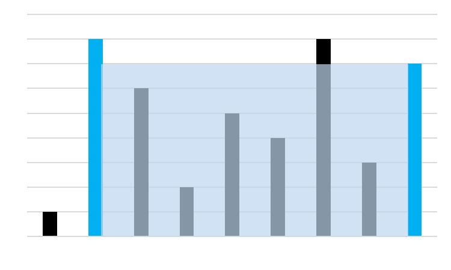

# Part 01. Java 기초 연습문제
## Table of Contents
| Part | Chapter | Subchapter | Number |       Solution       | Description |
| :--: | :-----: | :--------: | :----: | :------------------: | :---------: |
|  01  |   01    |    18_1    |   01   | [Java](./P1811.java) | 정수 역순으로 뒤집기 |
|  01  |   01    |    18_1    |   02   | [Java](./P1812.java) | 대소문자 변경 |
|  01  |   01    |    18_1    |   03   | [Java](./P1813.java) | String.replace() 구현 |
|  01  |   01    |    18_1    |   04   | [Java](./P1814.java) | 별 모양 프린트 |
|  01  |   01    |    18_1    |   05   | [Java](./P1815.java) | 저수량이 최대가 되는 벽 고르기 |
|  01  |   01    |    18_2    |   01   | [Java](./P1821.java) | 로마 숫자 → Integer |
|  01  |   01    |    18_2    |   02   | [Java](./P1822.java) | Integer → 로마 숫자 |
|  01  |   01    |    18_2    |   03   | [Java](./P1823.java) | 간단한 에디터 구현 |
|  01  |   01    |    18_2    |   04   | [Java](./P1824.java) | ASCII → String |
|  01  |   01    |    18_2    |   05   | [Java](./P1825.java) | 사탕 나눠주기 |
|  01  |   01    |    18_3    |   01   | [Java](./P1831.java) | 배열에서 중복 제거 후 정렬 |
|  01  |   01    |    18_3    |   02   | [Java](./P1832.java) | 배열에서 두 번 나타나는 정수들 반환 | 
|  01  |   01    |    18_3    |   03   | [Java](./P1833.java) | 배열에서 절대값 가까운 수 k개 출력 (작은 수 우선) |
|  01  |   01    |    18_3    |   04   | [Java](./P1834.java) | 2D 배열 나선형 방향 출력 |
|  01  |   01    |    18_3    |   05   | [Java](./P1835.java) | 벽 사이 총 저수량 |

## Chapter 01. Java 프로그래밍
### [Practice 1811](./P1811.java)
입력된 정수 자료형의 숫자를 거꾸로 변환하는 프로그램을 작성하세요.

- 예를들어 12345가 입력되면 54321로 변환하여 출력하면 된다.
- 100의 경우 001이 되는데 이 경우 1만 출력하도록 한다.

입출력 예시
---
|입력|결과|
|---|---|
|12345|54321|
|-12345|-54321|
|100|1|
|0|0|

### [Practice 1812](./P1812.java)
아스키 코드는 미국정보교환표준부호를 의미한다.  

영어로 American Standard Code for Information Interchange 이며, 줄여서 ASCII 라고 한다.  

문자를 사용하는 대부분의 장치에서 사용하며 문자 인코딩 방식에 아스키를 기초로 두고 있다.

다음은 아스키의 특징이다.
- 7비트로 구성
- 총 128개의 문자로 구성 (출력 불가능한 제어문자 33개, 출력 가능한 문자 95개)
- 출력 가능한 문자들은 52개의 영문 알파벳 대소문자와, 10개의 숫자, 32개의 특수 문자, 1개의 공백 문자로 이루어진다.

이번 문제에서는 아스키 코드 중 알파벳에 대해서,  
사용자가 입력한 알파벳의 대소문자를 변경하는 프로그램을 작성하시오. 

입출력 예시
---
|입력|결과|
|---|---|
|a|A|
|b|B|
|C|c|
|D|d|

### [Practice 1813](./P1813.java)
자바의 String 자료형에는 많은 연산자 기능들이 있다.

프로그래밍의 기본기를 익히기 위해 일부 연산자들을 제한하고 다음의 기능을 구현하려 한다.
- String 의 replace 기능 구현
- String의 replace, indexOf, contains를 사용하지 않고 구현한다.

입출력 예시
---
|입력 문자열|from|to|출력|
|---|---|---|---|
|"Hello Java, Nice to meet you! Java is fun!"|"Java"|"자바"|"Hello 자바, Nice to meet you! 자바 is fun!"|
|POP|P|W|WOW|

### [Practice 1814](./P1814.java)
여러가지 별찍기 연습을 해보자.  
반복문과 조건문의 연습에는 과연 별찍기 만한 것이 없다.

아래 5가지 별 찍기 타입이 있다.
- 아래 모양은 N (별 출력 행의 수)이 3일 떄의 출력 결과 들이다.

|타입|모양|
|---|---|
|1|***   ***   ***|
|2|*   **   ***|
|3|&nbsp;&nbsp;*   &nbsp;**   ***|
|4|&nbsp;&nbsp;*   &nbsp;***   *****|
|5|&nbsp;&nbsp;*   &nbsp;***   &nbsp;&nbsp;*|

별 출력 행의 수 N과 별 타입 T가 주어질 때 해당 별 모양을 출력하는 프로그램을 작성하세요.  
(N은 홀수)

입출력 예시
---
|N|T|출력|
|---|---|---|
|3|1|***   ***   ***|
|3|2|*   **   ***|
|3|3|&nbsp;&nbsp;*   &nbsp;**   ***|
|3|4|&nbsp;&nbsp;*   &nbsp;***   *****|
|7|5|&nbsp;&nbsp;&nbsp;*   &nbsp;&nbsp;***   &nbsp;*****   *******   &nbsp;*****   &nbsp;&nbsp;***   &nbsp;&nbsp;&nbsp;*|

### [Practice 1815](./P1815.java)
n개의 데이터가 height 배열에 주어졌다.  
height 배열의 각각의 원소는 아래 그림과 같이 각 벽에 대한 높이를 의미한다.

이와 같이 높이 값들이 주어졌을 때,  
이 중에서 어떤 두 벽을 고르면 가장 많은 물을 담을 수 있는지를 확인하고  
그 때의 면적을 출력하세요.

입출력 예시
---
|입력|출력|
|---|---|
|1, 8, 6, 2, 5, 4, 8, 3, 7|49|
|5, 3, 9, 2, 1, 1, 1, 1, 1, 1, 1, 1, 1, 2|26|

### [Practice 1821](./P1821.java)
로마 숫자 표기를 정수형으로 변환하는 프로그램을 작성하세요.

로마 숫자 표기법은 I, V, X, L, C, D, M 으로 이루어져있다.

|로마 숫자|정수형|
|---|---|
|I|1|
|V|5|
|X|10|
|L|50|
|C|100|
|D|500|
|M|1000|

로마 숫자 표기 방식
* 큰 기호에서 작은 기호 방향으로 작성 (XI, VI, II, ...)
* 다음의 경우 작은 기호가 큰 기호 앞에 올 수 있다.
  * I 는 V 와 X 의 앞에 올 수 있다. (IV: 4, IX: 9)
  * X 는 L 과 C 의 앞에 올 수 있다. (XL: 40, XC: 90)
  * C 는 D 와 M 의 앞에 올 수 있다. (CD: 400, CM: 900)
  
    
입출력 예시
---

|입력|출력|
|---|---|
|"III"|3|
|"IV"|4|
|"VI"|6|
|"XIII"|13|
|"XXVI"|26|
|"MCMXCIV"|1994|

### [Practice 1822](./P1822.java)
정수형 숫자를 로마 숫자 표기로 변환하는 프로그램을 작성하세요.

로마 숫자 표기법은 I, V, X, L, C, D, M 으로 이루어져있다.

|로마 숫자|정수형|
|---|---|
|I|1|
|V|5|
|X|10|
|L|50|
|C|100|
|D|500|
|M|1000|

로마 숫자 표기 방식
* 큰 기호에서 작은 기호 방향으로 작성 (XI, VI, II, ...)
* 다음의 경우 작은 기호가 큰 기호 앞에 올 수 있다.
    * I 는 V 와 X 의 앞에 올 수 있다. (IV: 4, IX: 9)
    * X 는 L 과 C 의 앞에 올 수 있다. (XL: 40, XC: 90)
    * C 는 D 와 M 의 앞에 올 수 있다. (CD: 400, CM: 900)

입출력 예시
---

|입력|출력|
|---|---|
|3|"III"|
|4|"IV"|
|6|"VI"|
|13|"XIII"|
|26|"XXVI"|
|1994|"MCMXCIV"|

### [Practice 1823](./P1823.java)
간단한 편집기를 구현하려고 한다.

편집기에는 문자열과 편집 명령어가 주어지는데, 명령어의 동작은 다음과 같다.
- L : 커서를 왼쪽으로 한 칸 옮김 (커서가 문장의 맨 앞이면 무시)
- D	: 커서를 오른쪽으로 한 칸 옮김 (커서가 문장의 맨 뒤이면 무시)
- B	: 커서 왼쪽에 있는 문자를 삭제 (커서가 문장의 맨 앞이면 무시)
- P x : x라는 문자를 커서 왼쪽에 추가

여기서 커서는 문자열에서 편집이 시작되는 기준 위치로,  
문장의 맨 앞, 맨 뒤, 중간에 위치할 수 있다.

편집기에 문자열과 명령어들이 주어졌을 때,  
편집을 완료한 후의 문자열을 출력하는 프로그램을 작성하시오.  
(초기 커서의 위치는 문장의 맨 뒤에서 시작한다.)  
(문자열은 소문자만 입력 가능하다.)

입출력 예시
---
|초기 문자열|명령어|결과 출력|
|---|---|---|
|"aba"|"L B"|"aa"|
|"abcd"|"P x L P y"|"abcdyx"|
|"abc"|"L L L P x L B P y"|"yxabc"|
|"a"|"B B L L D D P a P b P c"|"abc"|

### [Practice 1824](./P1824.java)
특수 작전을 위해 상대방의 PC에 키보드 입력 내용을 얻을 수 있는 키로깅 프로그램을 설치했다.

해당 키로깅 프로그램으로부터는 아래와 같이 특정 값으로 내용이 수신된다.
* 8 : Backspace
* 16 : Shift
* 20 : Caps Lock
* 32 : Space bar
* 37 : 키보드 왼쪽 화살표
* 39 : 키보드 오른쪽 화살표
* 155: Insert
* 127: Delete
* 97~122: 알파벳 소문자 (기본 입력은 소문자 기준, Shift 나 Caps Lock 에 의해 변경)
* 48~57: 숫자 0~9

(이 외의 값은 들어오지 않는다고 가정)

키로깅 프로그램으로부터 수신된 데이터를 원래 내용으로 복구하는 프로그램을 작성하세요.

입출력 예시
---
|수신 내용|결과|
|---|---|
|16, 106, 101, 108, 108, 111, 37, 37, 37, 37, 37, 155, 16, 104|"Hello"|
|20, 104, 16, 105, 32, 20, 16, 106, 97, 118, 97|"Hi Java"|
|49 51 8 50 51 53 55 37 37 127 127 52 53|"12345"|
|20 65 66 16 67 16 68 49 50 51|"ABcd!@#|

### [Practice 1825](./P1825.java)
N 명의 아이들이 한 줄로 서있다.  
각각의 아이들은 점수 표를 가지고 있는데 점수 표에 따라 다음과 같은 규칙으로 사탕을 나누어 줘야 한다.

* 적어도 1개 이상의 사탕을 나누어줘야 한다.
* 점수가 높은 아이에게는 바로 옆의 아이 보다는 사탕을 많이 줘야 한다.

N 명의 아이들에 대한 점수 표가 ratings 배열에 주어질 때,  
나누어 줘야하는 최소한의 사탕 개수를 출력하세요.

입출력 예시
---

|입력|출력|
|---|---|
|1 2 3|6|
|3 2 1|6|
|1 0 2|5|
|1 2 2|4|
|1, 3, 5, 3, 1, 3, 5, 7, 5, 3, 1, 0|29|

### [Practice 1831](./P1831.java)
정수형 오름차순 데이터가 nums 라는 배열에 주어졌다.  
현재 배열 내에는 중복된 데이터들이 들어있을 수 있는데 해당 중복들을 제거하는 프로그램을 작성하세요.

이 때, 추가 배열을 사용하지 않고 중복 데이터들을 제거해야 하며  
nums 배열 하나 만 사용하여 중복 데이터를 제거 후  
정렬된 데이터를 출력하세요.

입출력 예시
---
|입력|출력|
|---|---|
|1, 1, 2|1, 2|
|0, 0, 1, 1, 1, 2, 2, 3, 3, 4, 4|0, 1, 2, 3, 4|

### [Practice 1832](./P1832.java)
주어진 nums 배열에서 두 번 나타나는 모든 정수의 배열을 반환하는 프로그램을 작성하세요.  
* nums 배열은 [1, n] 범위의 정수로 이루어져 있다.
* 각 정수는 한 번 또는 두 번 나타날 수 있다.

반환을 위한 메모리 공간 외에 추가 적인 배열 사용은 하지 않는다.

입출력 예시
---
|입력|출력|
|---|---|
|4, 3, 2, 7, 8, 2, 3, 1|2, 3|
|1, 1, 2|1|
|1, 3, 1, 3, 5, 5|1, 3, 5|

### [Practice 1833](./P1833.java)
정렬된 정수형 배열 arr 이 주어졌을 때, 다음을 구하는 프로그램을 작성하세요.
* arr 과 함께 k 와 x 가 주어진다.
* k 는 개수, x 는 기준 값이다.
* x 와 절대 값 차이 기준으로 가까운 수를 k 개수 만큼 정렬된 순서로 출력하세요.
* 절대 값 차이가 같을 때는 숫자가 작은 것이 먼저 출력되도록 한다.

입출력 예시
---
|입력|k|x|출력|
|---|---|---|---|
|1, 2, 3, 4, 5|4|3|1, 2, 3, 4|
|1, 2, 3, 4, 5, 6, 7, 8, 9, 10|5|5|3, 4, 5, 6, 7|
|2, 4|1|3|2|
|2, 4|3|3|2, 4|

### [Practice 1834](./P1834.java)
MxN 행렬 정보가 2차원 정수형 배열 matrix 에 주어지면  
아래 그림과 같이 나선형 모양으로 출력하는 프로그램을 작성하세요.

입출력 예시
---
|입력|출력|
|---|---|
|{{1, 2, 3}, {4, 5, 6}, {7, 8, 9}}|1, 2, 3, 6, 9, 8, 7, 4, 5|
|{{1, 2, 3, 4}, {5, 6, 7, 8}, {9, 10 ,11 ,12}}|1, 2, 3, 4, 8, 12, 11, 10, 9, 5, 6, 7|

### [Practice 1835](./P1835.java)
n개의 정수형 데이터가 height 배열에 주어졌다.  
height 배열의 각각의 원소는 아래 그림과 같이 각 벽에 대한 높이를 의미한다.

이와 같이 높이 값들이 주어졌을 때,  
벽 사이사이의 빈 공간에 담을 수 있는 물의 총량을 출력하세요.

입출력 예시
---
|입력|출력|
|---|---|
|0, 1, 0, 2, 1, 0, 1, 3, 2, 1, 2, 1|6|
|4, 2, 0, 3, 2, 5|9|
