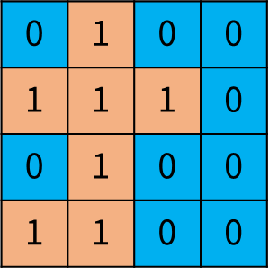
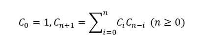
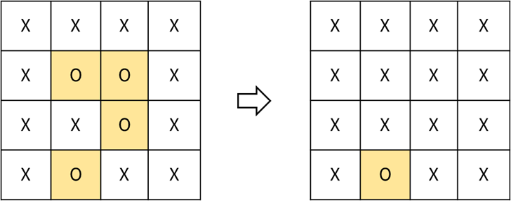

# Part 02. 자료구조/알고리즘
## Table of Contents
|               Problem #[^1]               |                 Solution                  | Origin | Description |
| :---------------------------------------: | :---------------------------------------: | :----: | :---------: |
| [01. 09_1. 01](./README.md#practice-0911) | [Java](./M0911.java) [Python](./M0911.py) | [leetcode](https://leetcode.com/problems/pascals-triangle/)                                           | 파스칼 삼각형 출력 |
| [01. 09_1. 02](./README.md#practice-0912) | [Java](./M0912.java)                      | [leetcode](https://leetcode.com/problems/previous-permutation-with-one-swap/)                                           | 한자리 정수 배열, 현배열 다음으로 큰 수 구하기 (1스왑) |
| [01. 09_1. 03](./README.md#practice-0913) | [Java](./M0913.java)                      | [leetcode](https://leetcode.com/problems/permutation-in-string/)                                           | str1의 permutation이 str2에 포함되는지 판별 |
| [01. 09_1. 04](./README.md#practice-0914) | [Java](./M0914.java)                      | [leetcode](https://leetcode.com/problems/happy-number/)                                           | 각 자리수 제곱의 합이 1로 수렴하는지 판정[^2] |
| [01. 09_1. 05](./README.md#practice-0915) | [Java](./M0915.java)                      | [leetcode](https://leetcode.com/problems/island-perimeter/)                                           | 해안선 길이 구하기 |
| [01. 09_2. 01](./README.md#practice-0921) | [Java](./M0921.java)                      | [leetcode](https://leetcode.com/problems/unique-binary-search-trees/)                                           | nth Catalan number[^3] |
| [01. 09_2. 02](./README.md#practice-0922) | [Java](./M0922.java)                      | [acmicpc](https://www.acmicpc.net/problem/17609)                                      | palindrome / pseudopalindrome[^4] |
| [01. 09_2. 03](./README.md#practice-0923) | [Java](./M0923.java)                      | [leetcode](https://leetcode.com/problems/solve-the-equation/)                                           | +-만 있는 1차 방정식 풀이 |
| [01. 09_2. 04](./README.md#practice-0924) | [Java](./M0924.java)                      | [leetcode](https://leetcode.com/problems/count-good-numbers/)                                           | 짝수 인덱스에는 짝수, 홀수 인덱스에는 소수인 숫자 갯수 |
| [01. 09_2. 05](./README.md#practice-0925) | [Java](./M0925.java)                      | [acmicpc](https://www.acmicpc.net/problem/1914)                                       | 하노이의 탑 |
| [02. 14_1. 01](./README.md#practice-1421) | [Java](./L1411.java)                      |                 | 주어진 코드에 의해 변형된 배열을 원배열로 되돌리기 |
| [02. 14_1. 02](./README.md#practice-1412) | [Java](./L1412.java)                      | [leetcode](https://leetcode.com/problems/set-matrix-zeroes/)                                           | 2D 배열에서 0이 있는 행과 열을 0으로 변경 |
| [02. 14_1. 03](./README.md#practice-1413) | [Java](./L1413.java)                      | [acmicpc](https://www.acmicpc.net/problem/2346)                                       | 풍선 터뜨리는 순서 |
| [02. 14_1. 04](./README.md#practice-1414) | [Java](./L1414.java)                      | [leetcode](https://leetcode.com/problems/valid-parentheses/)                                           | 괄호 정상여부 판정 |
| [02. 14_1. 05](./README.md#practice-1415) | [Java](./L1415.java)                      | [acmicpc](https://www.acmicpc.net/problem/3190)                                       | Snake 게임 종료시점 계산 |
| [02. 14_2. 01](./README.md#practice-1421) | [Java](./L1421.java) [Python](./L1421.py) | [programmers](https://programmers.co.kr/learn/courses/30/lessons/42587)                                      | 문서 중요도순 출력 |
| [02. 14_2. 02](./README.md#practice-1422) | [Java](./L1422.java)                      | [acmicpc](https://www.acmicpc.net/problem/1874)                                       | stack으로 특정 수열 만들기 |
| [02. 14_2. 03](./README.md#practice-1423) | [Java](./L1423.java)                      | [programmers](https://programmers.co.kr/learn/courses/30/lessons/42579)                                      | 장르카운트 → 고유카운트 → uid 순서 정렬 (장르별 2개) |
| [02. 14_2. 04](./README.md#practice-1424) | [Java](./L1424.java)                      | [programmers](https://programmers.co.kr/learn/courses/30/lessons/42576)                                      | p배열 중 c배열에 포함되지 않은 요소 구하기 (중복可) |
| [02. 14_2. 05](./README.md#practice-1425) | [Java](./L1425.java) [Python](./L1425.py) | [programmers](https://programmers.co.kr/learn/courses/30/lessons/67258)                                      | 배열상 요소를 한 종류씩 포함하는 최단 구간 |
| [03. 13_1. 01](./README.md#practice-1311) | [Java](./N1311.java)                      | [leetcode](https://leetcode.com/problems/word-search/)                                           | 2D array에서 문자열 찾기 |
| [03. 13_1. 02](./README.md#practice-1312) | [Java](./N1312.java)                      | [leetcode](https://leetcode.com/problems/surrounded-regions/)                                           | 2D array에서 x로 둘러싸인 부분 찾기 |
| [03. 13_1. 03](./README.md#practice-1313) | [Java](./N1313.java)                      | [leetcode](https://leetcode.com/problems/accounts-merge/)                                           | 중복 이메일 병합 (동명이인 존재) |
| [03. 13_1. 04](./README.md#practice-1314) | [Java](./N1314.java)                      | [leetcode](https://leetcode.com/problems/open-the-lock/)                                           | 4 digit combination padlock 회전수 계산 |
| [03. 13_1. 05](./README.md#practice-1315) | [Java](./N1315.java)                      | [leetcode](https://leetcode.com/problems/minimum-jumps-to-reach-home/)                                           | 1D 로봇 이동횟수 계산 |
| [03. 13_2. 01](./README.md#practice-1321) | [Java](./N1321.java) [Python](./N1321.py) | [leetcode](https://leetcode.com/problems/the-number-of-the-smallest-unoccupied-chair/)                                           | 가장 낮은 번호 의자에 앉기 |
| [03. 13_2. 02](./README.md#practice-1322) | [Java](./N1322.java)                      | [leetcode](https://leetcode.com/problems/minimum-interval-to-include-each-query/)                                           | 각 쿼리를 포함하는 최소구간 |
| [03. 13_2. 03](./README.md#practice-1323) | [Java](./N1323.java)                      | [leetcode](https://leetcode.com/problems/construct-target-array-with-multiple-sums/)                                           | 초기 배열을 타겟 배열로 변형 가부 |
| [03. 13_2. 04](./README.md#practice-1324) | [Java](./N1324.java)                      | [leetcode](https://leetcode.com/problems/maximum-performance-of-a-team/)                                           | 팀 작업성능 최적화 |
| [03. 13_2. 05](./README.md#practice-1325) | [Java](./N1325.java)                      | [leetcode](https://leetcode.com/problems/camelcase-matching/)                                           | 문자열+패턴으로 주어진 문자열들을 만들 수 있는지 판별 |
| [03. 13_3. 01](./README.md#practice-1331) | [Java](./N1331.java)                      | [acmicpc](https://www.acmicpc.net/problem/10026)                                      | 일반인과 색약자에게 보이는 구역수 판정 |
| [03. 13_3. 02](./README.md#practice-1332) | [Java](./N1332.java)                      |                 | 불을 켤 수 있는 방의 최대수 |
| [03. 13_3. 03](./README.md#practice-1333) | [Java](./N1333.java)                      | [acmicpc](https://www.acmicpc.net/problem/17612)                                      | 여러 계산대가 있을 때 계산 완료 순서 |
| [03. 13_3. 04](./README.md#practice-1334) | [Java](./N1334.java)                      | [programmers](https://programmers.co.kr/learn/courses/30/lessons/42577)                                      | 전화번호가 다른 전화번호의 접두어인지 식별 |
| [03. 13_3. 05](./README.md#practice-1335) | [Java](./N1335.java)                      | [acmicpc](https://www.acmicpc.net/problem/5670)                                       | 자동완성 평균 타이핑 수 계산 |

[^1]: `String.format("%02d. %02d_%d. %02d", chapter, subchapter, subchapterOfSubchapter, problemNo)`
[^2]: [Happy Number](https://en.wikipedia.org/wiki/Happy_number)
[^3]: [Catalan Number](https://en.wikipedia.org/wiki/Catalan_number)
[^4]: which becomes a palindrome after removing exactly one character.

## Chapter 01. 기초 수학
### [Practice 0911](./M0911.java)
파스칼의 삼각형(Pascal's triangle)은 수학에서 이항계수를 삼각형 모양의 기하학적 형태로 배열한 것이다.

파스칼의 삼각형은 다음과 같이 만들 수 있다.

1. 첫 번째 줄에는 숫자 1을 쓴다.
2. 그 다음 줄은 바로 위의 왼쪽 숫자와 오른쪽 숫자를 더한다.


삼각형의 행의 수가 입력으로 주어졌을 때,  
파스칼의 삼각형을 출력하시오.


입출력 예시
---

|입력|출력|
|---|---|
|1|[[1]]|
|3|[[1], [1, 1], [1, 2, 1]]|
|5|[[1], [1, 1], [1, 2, 1], [1, 3, 3, 1], [1, 4, 6, 4, 1]]|

---

### [Practice 0912](./M0912.java)
양의 정수로 이루어진 arr 배열이 주어졌을 때  
해당 데이터로 만들 수 있는 permutation 중에서 다음과 같은 데이터를 출력하는 프로그램을 작성하세요.

- 현재 데이터보다 이전의 큰 수를 출력
- 한 번의 swap 으로 출력 가능한 큰 수를 출력


입출력 예시
---

|입력|출력|
|---|---|
|3, 2, 1|3, 1, 2|
|1, 9, 4, 7, 6|1, 9, 4, 6, 7|
|1, 1, 2, 3|1, 1, 2, 3|

---

### [Practice 0913](./M0913.java)
문자열 s1 과 s2 가 주어졌을 때,  
s1 을 permutation 한 문자열이 s2 의 부분 문자열에 해당하면 true 를 반환하고  
그렇지 않으면 false 를 반환하는 프로그램을 작성하세요.


입출력 예시
---

|s1|s2|출력|
|---|---|---|
|"ab"|"adbak"|true|
|"ac"|"car"|true|
|"ak"|"aabbkk"|false|

---

### [Practice 0914](./M0914.java)
주어진 양의 정수가 **행복한 수** 인지를 판별하는 프로그램을 작성하세요.

행복한 수란,  
각 자리수를 제곱한 것을 더하는 과정을 반복했을 때 1로 끝나는 수 이다. 
행복한 수가 아니라면 1에 도달하지 못하고 같은 수열이 반복하게 된다.

'행복한 수'를 찾는 과정 예시
  ```
  19 가 행복한 수인지 확인하는 과정
  1^2 + 9^2 = 82
  8^2 + 2^2 = 68
  6^2 + 8^2 = 100
  1^2 + 0^2 + 0^2 = 1
  ```

입출력 예시
---

|입력|출력|
|---|---|
|19|true|
|2|false|
|61|false|

---

### [Practice 0915](./M0915.java)
영토에 대한 지도 정보가 row x col grid 맵 형태로 다음과 같이 주어졌다.

이 때, grid[i][j] 가 1이 면 땅 영역을 의미하고  
grid[i][j] 가 0 이면 물 영역을 의미한다.




이와 같이 영토에 대한 지도 정보가 주어졌을 때 땅의 둘레를 구하는 프로그램을 작성하세요.

- grid 한 cell 의 변의 길이는 1 이다.
- 지도에는 하나의 독립된 영토만 있다. (분리된 땅 없음)
- 땅 내부에 물이 존재하지 않는다.


입출력 예시
---

|입력|출력|
|---|---|
|{{1}}|4|
|{{0, 1, 0, 0}, {1, 1, 1, 0}, {0, 1, 0, 0}, {1, 1, 0, 0}}|16|

---

### [Practice 0921](./M0921.java)
카탈랑 수는 0번, 1번, 2번, ... 순으로 아래와 같이 구성되는 수열을 의미한다.
- 1, 1, 2, 5, 14, 42, 132, 429, 1430, 4862, … 

이를 점화식으로 나타내면 아래와 같다.



카탈랑 수의 n 번째 값을 구하는 프로그램을 작성하세요.


입력 예시
---
|입력|출력|
|---|---|
|0|1|
|2|2|
|5|42|
|7|429|

---

### [Practice 0922](./M0922.java)
회문 또는 팰린드롬(palindrome)은 앞 뒤 방향으로 같은 순서의 문자로 구성된 문자열을 말한다.  
- 예시) ‘abba’ ‘kayak’, ‘madam’


<br/>

유사회문은 문자열 그 자체는 회문이 아니지만 한 문자를 삭제하면 회문이 되는 문자열을 말한다.  
- 예시) ‘summuus’의 5번째 또는 6번째 문자 ‘u’를 제거하면 ‘summus’인 회문을 만들 수 있다.

<br/>
주어진 문자열을 확인한 후 문자열 종류에 따라 다음과 같이 출력하는 프로그램을 작성하세요.

- 회문: 0
- 유사회문: 1
- 기타: 2


입력 예시
---
|입력|출력|
|---|---|
|abba|0|
|summuus|1|
|xabba|1|
|xabbay|2|
|comcom|2|
|comwwmoc|0|
|comwwtmoc|1|

---

### [Practice 0923](./M0923.java)
주어진 1차 방정식에 대해 풀이를 하는 프로그램을 작성하세요.

해당 방정식은 '+', '-', 'x' 와 '상수'로만 이루어져 있다.

해가 없으면 "No solution" 을 출력,  
해가 무한대인 경우 "Infinite solutions" 를 출력,  
해가 있는 경우 x의 값을 "x=" 형태로 출력 하세요.


입력 예시
---
|입력|출력|
|---|---|
|"x+5-3+x=6+x-2"|"x=2"|
|"x=x"|"Infinite solutions"|
|"2x=x"|"x=0"|

---

### [Practice 0924](./M0924.java)
아래와 같이 구성되는 좋은 수라고 한다.
* 짝수 인덱스 위치에는 짝수
* 홀수 인덱스 위치에는 소수 (2, 3, 5, 7)
* 인덱스는 0 부터 시작

```
예를 들면,
2582 는 좋은 수다.
- 짝수 인덱스 위치에는 짝수인 2와 8로, 홀수 위치에는 소수인 5와 2로 구성된다.

반면,
3245 는 좋은 수가 아니다.
- 짝수 인덱스 위치에 홀수인 3이 위치하고 있다.
```

1 이상의 정수 n이 주어졌을 때, n 자리로 구성될 수 있는 좋은 수의 개수를 출력하는 프로그램을 작성하세요.

단, n 의 값에 따라 값이 클 수 있으니 결과는 10^9 + 7로 나머지 연산을 한 결과로 출력하시오. 


입력 예시
---
|입력|출력|
|---|---|
|1|5|
|2|20|
|3|100|
|4|400|
|50|564908303|

---

### [Practice 0925](./M0925.java)
하노이의 탑은 퍼즐의 일종이다.

  
(Fig. 1. Tower of Hanoi from: wikipedia)

하노이의 탑 퍼즐 게임 규칙은 다음과 같다.
* 한 번에 한 개의 원판 만 옮길 수 있다.
* 큰 원판이 작은 원판 위에 있어서는 안된다.


원판의 개수 n 이 주어졌을 때  
가장 왼쪽 기둥으로부터 끝 기둥으로 이동하는 과정에 대해 출력하는 프로그램을 구현하세요.


입력 예시
---
|입력|출력|
|---|---|
|2|1 2 <br/> 1 3 <br/> 2 3|
|3|1 3 <br/> 1 2 <br/> 3 2 <br/> 1 3 <br/> 2 1 <br/> 2 3 <br/> 1 3|


# Chapter 2: 선형 자료구조
### [Practice 1411](./L1411.java)
과거에 하기의 modification 함수를 이용해 배열 내 데이터 순서를 변경했었다.

- 최근에 이 변경한 데이터들을 다시 원래의 배열 순서로 변경해야 하는 일이 생겼다.
- 아래의 modification 코드를 분석 후 되돌리는 코드를 작성하세요.


```java
public static int[] modification(int[] arr) {
        int[] arrNew = new int[arr.length];

        int idx = 0;
        int cnt = 0;
        int val = arr[idx];

        while (cnt < arr.length) {
            while (val == 0) {
                idx = (idx + 1) % arr.length;
                val = arr[idx];
            }
            arrNew[cnt++] = val;
            arr[idx] = 0;
            idx = (val + idx) % arr.length;
            val = arr[idx];
        }
        return arrNew;
    }
```

Modification 당시 입출력 샘플
---
|입력|출력|
|---|---|
|1 3 5 7 9|1 3 7 9 5|
|3 6 8 2|3 2 6 8|

되돌리기 입출력 예시
---
|입력|출력|
|---|---|
|1 3 7 9 5|1 3 5 7 9|
|3 2 6 8|3 6 8 2|

---

### [Practice 1412](./L1412.java)
정수로 이루어진 M x N 행렬 데이터가 있다고 하자.

- 행렬의 원소 중에 0이 있을 경우 해당 원소가 위치하는 행과 열 전체 데이터를 0으로 변경하는 코드를 작성하세요.


입출력 예시
---


---

### [Practice 1413](./L1413.java)
1번부터 N번까지 N개의 풍선이 원형으로 놓여 있고. i번 풍선의 오른쪽에는 i+1번 풍선이 있고, 왼쪽에는 i-1번 풍선이 있다.  
단, 1번 풍선의 왼쪽에 N번 풍선이 있고, N번 풍선의 오른쪽에 1번 풍선이 있다.  
각 풍선 안에는 종이가 하나 들어있고, 종이에는 -N보다 크거나 같고, N보다 작거나 같은 정수가 하나 적혀있다.  
이 풍선들을 다음과 같은 규칙으로 터뜨린다.

우선, 제일 처음에는 1번 풍선을 터뜨린다.  
다음에는 풍선 안에 있는 종이를 꺼내어 그 종이에 적혀있는 값만큼 이동하여 다음 풍선을 터뜨린다.  
양수가 적혀 있을 경우에는 오른쪽으로, 음수가 적혀 있을 때는 왼쪽으로 이동한다.  
이동할 때에는 이미 터진 풍선은 빼고 이동한다.

예를 들어 다섯 개의 풍선 안에 차례로 3, 2, 1, -3, -1이 적혀 있었다고 하자.  
이 경우 3이 적혀 있는 1번 풍선, -3이 적혀 있는 4번 풍선, -1이 적혀 있는 5번 풍선, 1이 적혀 있는 3번 풍선, 2가 적혀 있는 2번 풍선의 순서대로 터지게 된다.


입력 예시
---
|입력|결과|
|---|---|
|3, 2, 1, -3, -1|1 4 5 3 2|
|3, 2, -1, -2|1 4 2 3|

---

### [Practice 1414](./L1414.java)
입력 문자열에서 괄호 짝 검사하여 이상이 없는지 판별하는 프로그램을 작성하세요.

- 괄호의 종류: (), {}, []
- 괄호 짝 이상이 없으면 Pass 출력
- 괄호 짝 이상이 있으면 Fail 출력
- 괄호 짝 이상 유무는 괄호를 열었으면 그에 대응되는 괄호로 닫혀 있는 것으로 판별한다.

입출력 예시
---
|입력 문자열|결과|
|---|---|
|"[yyyy]-[mm]-[dd]"|Pass|
|"System.out.println(arr[0][1))"|Fail|
|"Support [Java or Python(3.x)]"|Pass|

---

### [Practice 1415](./L1415.java)
'Dummy' 라는 도스게임이 있다. 이 게임에는 뱀이 나와서 기어다니는데, 사과를 먹으면 뱀 길이가 늘어난다. 뱀이 이리저리 기어다니다가 벽 또는 자기자신의 몸과 부딪히면 게임이 끝난다.

게임은 NxN 정사각 보드위에서 진행되고, 몇몇 칸에는 사과가 놓여져 있다. 보드의 상하좌우 끝에 벽이 있다. 게임이 시작할때 뱀은 맨위 맨좌측에 위치하고 뱀의 길이는 1 이다. 뱀은 처음에 오른쪽을 향한다.

뱀은 매 초마다 이동을 하는데 다음과 같은 규칙을 따른다.

- 먼저 뱀은 몸길이를 늘려 머리를 다음칸에 위치시킨다.
- 만약 이동한 칸에 사과가 있다면, 그 칸에 있던 사과가 없어지고 꼬리는 움직이지 않는다.
- 만약 이동한 칸에 사과가 없다면, 몸길이를 줄여서 꼬리가 위치한 칸을 비워준다. 즉, 몸길이는 변하지 않는다.
- 사과의 위치와 뱀의 이동경로가 주어질 때 이 게임이 몇 초에 끝나는지 계산하라.

- 입력
    - 보드의 크기 N (2 ≤ N ≤ 100)
    - 사과의 개수 K (0 ≤ K ≤ 100)
    - 뱀의 방향 변환 횟수 L (1 ≤ L ≤ 100)
    - 사과의 위치가 담긴 리스트 apples
        - 첫 번째 정수는 행, 두 번째 정수는 열 위치를 의미한다. 사과의 위치는 모두 다르며, 맨 위 맨 좌측 (1행 1열) 에는 사과가 없다.
    - 뱀의 방향 변환 정보 moves
        - 정수 X와 문자 C로 이루어져 있으며. 게임 시작 시간으로부터 X초가 끝난 뒤에 왼쪽(C가 'L') 또는 오른쪽(C가 'D')로 90도 방향을 회전시킨다는 뜻이다. X는 10,000 이하의 양의 정수이며, 방향 전환 정보는 X가 증가하는 순으로 주어진다.

입출력 예시
---
- 예시입력1
    - 입력
      ```python
      N = 6
      K = 3
      L = 3
      apples = [(3, 4), (2, 5), (5, 3)]
      moves = [(3, 'D'), (15, 'L'), (17, 'D')]
      ```
    - 출력: 9

- 예시입력2
    - 입력
      ```python
      N = 10
      K = 4
      L = 4
      apples = [(1, 2), (1, 3), (1, 4), (1, 5)]
      moves = [(8, 'D'), (10, 'D'), (11, 'D'), (13, 'L')]
      ```
    - 출력: 21

- 예시입력3
    - 입력
      ```python
      N = 10
      K = 5
      L = 4
      apples = [(1, 5), (1, 3), (1, 2), (1, 6), (1, 7)]
      moves = [(8, 'D'), (10, 'D'), (11, 'D'), (13, 'L')]
      ```
    - 출력: 13

---

### [Practice 1421](./L1421.java)
여러분도 알다시피 여러분의 프린터 기기는 여러분이 인쇄하고자 하는 문서를 인쇄 명령을 받은 ‘순서대로’,  
즉 먼저 요청된 것을 먼저 인쇄한다. 여러 개의 문서가 쌓인다면 Queue 자료구조에 쌓여서 FIFO - First In First Out - 에 따라 인쇄가 되게 된다.  
하지만 상근이는 새로운 프린터기 내부 소프트웨어를 개발하였는데, 이 프린터기는 다음과 같은 조건에 따라 인쇄를 하게 된다.

현재 Queue의 가장 앞에 있는 문서의 ‘중요도’를 확인한다.  
나머지 문서들 중 현재 문서보다 중요도가 높은 문서가 하나라도 있다면, 이 문서를 인쇄하지 않고 Queue의 가장 뒤에 재배치 한다.  
그렇지 않다면 바로 인쇄를 한다.
예를 들어 Queue에 4개의 문서(A B C D)가 있고, 중요도가 2 1 4 3 라면 C를 인쇄하고, 다음으로 D를 인쇄하고 A, B를 인쇄하게 된다.

현재 Queue에 있는 문서의 수와 중요도가 주어졌을 때, 어떤 한 문서가 몇 번째로 인쇄되는지 알아내는 코드를 작성하세요.  
예를 들어 위의 예에서 C문서는 1번째로, A문서는 3번째로 인쇄되게 된다.


입출력 예시
---
|문서 개수|출력 대상 번호|우선순위|출력|
|---|---|---|---|
|1|0|5|1|
|4|2|1 2 3 4|2|
|6|0|1 1 9 1 1 1|5|

---

### [Practice 1422](./L1422.java)
스택 (stack)은 기본적인 자료구조 중 하나로, 컴퓨터 프로그램을 작성할 때 자주 이용되는 개념이다.  
스택은 자료를 넣는 (push) 입구와 자료를 뽑는 (pop) 입구가 같다.  
제일 나중에 들어간 자료가 제일 먼저 나오는 (LIFO, Last in First out) 특성을 가지고 있다.

- 1부터 n까지의 수를 스택에 넣었다가 뽑아 늘어놓음으로써, 하나의 수열을 만들 수 있다.
- 이때, 스택에 push 하는 순서는 반드시 오름차순을 지키도록 한다고 하자.

임의의 수열이 주어졌을 때 스택을 이용해 그 수열을 만들 수 있는지 없는지,  
있다면 어떤 순서로 push와 pop 연산을 수행해야 하는지를 계산하는 프로그램을 작성하시오.  
같은 정수가 두 번 나오는 경우는 없다.


입출력 예시
---
|입력|결과|
|---|---|
|4 3 6 8 7 5 2 1|+ + + + - - + + - + + - - - - -|
|1 2 5 3 4|NO|

---

### [Practice 1423](./L1423.java)
스트리밍 사이트에서 장르 별로 가장 많이 재생된 노래를 두 개씩 모아 베스트 앨범을 출시하려 합니다.  
노래는 고유 번호로 구분하며, 노래를 수록하는 기준은 다음과 같습니다.

- 속한 노래가 많이 재생된 장르를 먼저 수록합니다.
- 장르 내에서 많이 재생된 노래를 먼저 수록합니다.
- 장르 내에서 재생 횟수가 같은 노래 중에서는 고유 번호가 낮은 노래를 먼저 수록합니다.

노래의 장르를 나타내는 문자열 배열 genres와 노래별 재생 횟수를 나타내는 정수 배열 plays가 주어질 때, 베스트 앨범에 들어갈 노래의 고유 번호를 순서대로 return 하도록 solution 함수를 완성하세요.

###제한사항
- genres[i]는 고유번호가 i인 노래의 장르입니다.
- plays[i]는 고유번호가 i인 노래가 재생된 횟수입니다.
- genres와 plays의 길이는 같으며, 이는 1 이상 10,000 이하입니다.
- 장르 종류는 100개 미만입니다.
- 장르에 속한 곡이 하나라면, 하나의 곡만 선택합니다.
- 모든 장르는 재생된 횟수가 다릅니다.

입출력 예시
---
|genres|plays|return|
|---|---|---|
|["classic", "pop", "classic", "classic", "pop"]|[500, 600, 150, 800, 2500]|[4, 1, 3, 0]|

* 입출력 예 설명 
  - classic 장르는 1,450회 재생되었으며, classic 노래는 다음과 같습니다.
    - 고유 번호 3: 800회 재생
    - 고유 번호 0: 500회 재생
    - 고유 번호 2: 150회 재생
  - pop 장르는 3,100회 재생되었으며, pop 노래는 다음과 같습니다.
    - 고유 번호 4: 2,500회 재생
    - 고유 번호 1: 600회 재생
  - 따라서 pop 장르의 [4, 1]번 노래를 먼저, classic 장르의 [3, 0]번 노래를 그다음에 수록합니다.

---

### [Practice 1424](./L1424.java)
수많은 마라톤 선수들이 마라톤에 참여하였습니다. 단 한 명의 선수를 제외하고는 모든 선수가 마라톤을 완주하였습니다.

마라톤에 참여한 선수들의 이름이 담긴 배열 participant와 완주한 선수들의 이름이 담긴 배열 completion이 주어질 때, 완주하지 못한 선수의 이름을 return 하도록 solution 함수를 작성해주세요.

- 제한사항
- 마라톤 경기에 참여한 선수의 수는 1명 이상 100,000명 이하입니다.
- completion의 길이는 participant의 길이보다 1 작습니다.
- 참가자의 이름은 1개 이상 20개 이하의 알파벳 소문자로 이루어져 있습니다.
- 참가자 중에는 동명이인이 있을 수 있습니다.
  
입출력 예시
---
|participant|completion|return|
|-----|-------|------|
|["leo", "kiki", "eden"]|["eden", "kiki"]|"leo"|
|["marina", "josipa", "nikola", "vinko", "filipa"]| ["josipa", "filipa", "marina", "nikola"]|"vinko"|
|["mislav", "stanko", "mislav", "ana"]|["stanko", "ana", "mislav"]|"mislav"|

- 입출력 예에 대한 설명
  - 예제 1: "leo"는 참여자 명단에는 있지만, 완주자 명단에는 없기 때문에 완주하지 못했습니다.
  - 예제 2: "vinko"는 참여자 명단에는 있지만, 완주자 명단에는 없기 때문에 완주하지 못했습니다.
  - 예제 3: "mislav"는 참여자 명단에는 두 명이 있지만, 완주자 명단에는 한 명밖에 없기 때문에 한명은 완주하지 못했습니다.

---

### [Practice 1425](./L1425.java)
개발자 출신으로 세계 최고의 갑부가 된 어피치는 스트레스를 받을 때면 이를 풀기 위해 오프라인 매장에 쇼핑을 하러 가곤 합니다.
어피치는 쇼핑을 할 때면 매장 진열대의 특정 범위의 물건들을 모두 싹쓸이 구매하는 습관이 있습니다.
어느 날 스트레스를 풀기 위해 보석 매장에 쇼핑을 하러 간 어피치는 이전처럼 진열대의 특정 범위의 보석을 모두 구매하되 특별히 아래 목적을 달성하고 싶었습니다.

```
진열된 모든 종류의 보석을 적어도 1개 이상 포함하는 가장 짧은 구간을 찾아서 구매
```

예를 들어 아래 진열대는 4종류의 보석(RUBY, DIA, EMERALD, SAPPHIRE) 8개가 진열된 예시입니다.

|진열대 번호|1|2|3|4|5|6|7|8|
|---------|---|---|---|---|---|---|---|---|
|보석 이름|DIA|RUBY|RUBY|DIA|DIA|EMERALD|SAPPHIRE|DIA|

진열대의 3번부터 7번까지 5개의 보석을 구매하면 모든 종류의 보석을 적어도 하나 이상씩 포함하게 됩니다.

진열대의 3, 4, 6, 7번의 보석만 구매하는 것은 중간에 특정 구간(5번)이 빠지게 되므로 어피치의 쇼핑 습관에 맞지 않습니다.

진열대 번호 순서대로 보석들의 이름이 저장된 배열 gems가 매개변수로 주어집니다. 이때 모든 보석을 하나 이상 포함하는 가장 짧은 구간을 찾아서 return 하도록 solution 함수를 완성해주세요.
가장 짧은 구간의 시작 진열대 번호와 끝 진열대 번호를 차례대로 배열에 담아서 return 하도록 하며, 만약 가장 짧은 구간이 여러 개라면 시작 진열대 번호가 가장 작은 구간을 return 합니다.

- 제한사항
    - gems 배열의 크기는 1 이상 100,000 이하입니다.
    - gems 배열의 각 원소는 진열대에 나열된 보석을 나타냅니다.
    - gems 배열에는 1번 진열대부터 진열대 번호 순서대로 보석이름이 차례대로 저장되어 있습니다.
    - gems 배열의 각 원소는 길이가 1 이상 10 이하인 알파벳 대문자로만 구성된 문자열입니다.

입출력 예시
---

|gems|result|
|----|------|
|["DIA", "RUBY", "RUBY", "DIA", "DIA", "EMERALD", "SAPPHIRE", "DIA"]|[3, 7]|
|["AA", "AB", "AC", "AA", "AC"]|[1, 3]|
|["XYZ", "XYZ", "XYZ"]|[1, 1]|
|["ZZZ", "YYY", "NNNN", "YYY", "BBB"]|[1, 5]|

- 입출력 예에 대한 설명
    - 입출력 예 #1
        - 문제 예시와 같습니다.

    - 입출력 예 #2
        - 3종류의 보석(AA, AB, AC)을 모두 포함하는 가장 짧은 구간은 [1, 3], [2, 4]가 있습니다.
        - 시작 진열대 번호가 더 작은 [1, 3]을 return 해주어야 합니다.

    - 입출력 예 #3
        - 1종류의 보석(XYZ)을 포함하는 가장 짧은 구간은 [1, 1], [2, 2], [3, 3]이 있습니다.
        - 시작 진열대 번호가 가장 작은 [1, 1]을 return 해주어야 합니다.

    - 입출력 예 #4
        - 4종류의 보석(ZZZ, YYY, NNNN, BBB)을 모두 포함하는 구간은 [1, 5]가 유일합니다.
        - 그러므로 [1, 5]를 return 해주어야 합니다.


# Chatper 3: 비선형 자료구조
### [Practice 1311](./N1311.java)
row x col 행렬 형태의 board 와 word 문자열이 주어졌을 때,  
해당 행렬에서 word 문자열이 인접하게 연결되어 있는지를 확인하는 프로그램을 작성하세요.

아래와 같은 행렬에서 word 로 "ABCCED" 가 주어진 경우 다음과 같이 인접해 있음을 확인할 수 있다.

인접하게 구성이되면 true 를 반환하고 그렇지 않으면 false 를 반환하시오.


입출력 예시
---
|board|word|결과|
|---|---|---|
|{'A', 'B', 'C', 'E'}, {'S', 'F', 'C', 'S'}, {'A', 'D', 'E', 'E'}|"ABCCED"|true|
|{'A', 'B', 'C', 'E'}, {'S', 'F', 'C', 'S'}, {'A', 'D', 'E', 'E'}|"SEE"|true|
|{'A', 'B', 'C', 'E'}, {'S', 'F', 'C', 'S'}, {'A', 'D', 'E', 'E'}|"ABCB"|false|

---

### [Practice 1312](./N1312.java)
row x col 행렬 형태의 보드에 다음과 같이 X, O 로 표시가 되어 있다.



이 때 X 로 둘러쌓여있는 O 는 X로 변경하고,  
상하좌우 방향으로 O 에 연결되어 있는 O 는 그대로 O 로 유지한 후 출력하는 프로그램을 작성하세요.

참고) 외곽부에 닿아 있는 O 는 X 로 둘러쌓여있지 않은 것으로 본다.

입출력 예시
---
|입력|결과|
|---|---|
|X X X X <br/> X O O X <br/> X X O X <br/> X O X X |X X X X <br/> X X X X <br/> X X X X <br/> X O X X |
|X X X X <br/> X O O X <br/> X X O X <br/> X O O X |X X X X <br/> X O O X <br/> X X O X <br/> X O O X|

---

### [Practice 1313](./N1313.java)
이메일 정보를 병합하는 프로그램을 구현하려고 한다.  
이메일 정보가 들어있는 2차원 문자열 배열 accounts 가 주어졌고,  
각각의 accounts[i] 에 대해 accounts[i][0] 에는 사람 이름을, 나머지는 이메일을 나타낸다.

<br/>

주어진 이메일 정보에는 한 사람이 여러 이메일을 소유하기도, 동명이인이 있기도 하다.
- 이름이 같고 이메일이 다르면 동명이인이다.
- 이름이 같고 이메일 중 같은 이메일이 있으면 동일 인이다.


주어진 이메일을 정보를 병합하고 출력하는 프로그램을 작성하세요. 

입출력 예시
---
|입력|결과|
|---|---|
|"John", "john@mail.com", "john_lab@mail.com" <br/> "John", "john@mail.com", "john02@mail.com" <br/> "Mary", "mary@mail.com" <br/> "John", "johnnybravo@mail.com"|"John, johnnybravo@mail.com" <br/> "John, john02@mail.com, john@mail.com, john_lab@mail.com" <br/> Mary, mary@mail.com|

---

### [Practice 1314](./N1314.java)
네 자리 비밀번호를 설정할 수 있는 자물쇠가 주어졌다.  
원형 바퀴 형태로 숫자를 돌려가며 설정하는 방식이고, 아래와 같은 숫자로 구성된다.
* '0', '1', '2', '3', '4', '5', '6', '7', '8', '9'. 

바퀴의 숫자는 다음과 같이 전후 이동이 가능하다.
* '9'를 '0'으로 바꾸거나 '0'을 '9'로 바꿀 수 있다.
* 각 이동은 숫자 한 칸 이동하는 것을 의미한다.

<br/>

주어진 요구사항은 다음과 같다.  
* 자물쇠의 처음 번호 시작은 '0000'에서 시작하고,  deadends 목록과 target 이 주어진다.  
* 자물쇠를 몇번 이동을 시키면 target 에 도달하는지 계산하는 프로그램을 작성하세요.  
* 단, deadends 목록에 있는 수로 이동해서는 안된다.
* 이동이 가능하면 이동 횟수를 반환하고 그렇지 않은 경우 -1 을 반환하세요.

입출력 예시
---
|deadends|target|결과|
|---|---|---|
|"8888"|"0009"|1|
|"0201","0101","0102","1212","2002"|"0202"|6|

---

### [Practice 1315](./N1315.java)
x 축 상에 앞 뒤로만 이동할 수 있는 로봇이 0 위치에 놓여 있다.  
해당 로봇은 다음과 같은 규칙으로 움직일 수 있다.  
* forward 방향으로는 a 만큼 움직일 수 있다.
* backward 방향으로는 b 만큼 움직일 수 있다.
* backward 로 연속해서 2번 움직일 수 없다.
* forbidden 위치로는 갈 수 없다.
* 음수 지역으로 갈 수 없다.

forbidden 배열과 a, b, 그리고 목적지 x 가 주어졌을 때,  
몇 번의 이동으로 목적지에 도달 할 수 있는지 계산하는 프로그램을 구현하세요.  
이동이 가능하면 이동횟수를, 이동이 불가능하면 -1을 반환하세요.

입출력 예시
---
|forbidden|a|b|x|결과|
|---|---|---|---|---|
|14, 4, 18, 1, 15|3|15|9|3|
|1, 6, 2, 14, 5, 17, 4|16|9|7|2|
|8, 3, 16, 6, 12, 20|15|13|11|-1|

---

### [Practice 1321](./N1321.java)
n 명의 친구가 참석하는 파티가 계획되어 있다. (n = 0 ~ n-1)  
파티 장소에는 친구들이 앉을 수 있는 충분한 의자들이 있고 
의자에는 0, 1, 2, ... 순으로 번호가 적혀있다.

먼저 도착한 친구 순으로 비어 있는 의자 중에서 가장 숫자가 작은 의자에 앉는다.  

2차원 정수형 배열 times 와 정수 targetFriend 가 주어졌으며 각각의 의미는 다음과 같다.
* times: 친구 별 {도착 시간, 떠나는 시간} 정보로 이루어진 2차원 배열
* targetFriend: 어디에 앉았는지 확인할 친구

위와 같은 정보를 바탕으로, targetFriend 가 앉게되는 의자의 번호를 출력하세요.

입출력 예시
---
|times|targetFriend|결과|
|---|---|---|
|{{1, 4}, {2, 3}, {4, 6}}|1|1|
|{{3, 10}, {1, 5}, {2, 6}}|0|2|

---

### [Practice 1322](./N1322.java)
정수형 2차원 배열 intervals 와 정수형 배열 queries 가 주어졌으며 각각의 의미는 다음과 같다.
* intervals : 구간의 {시작 값, 종료 값} 데이터들로 2차원으로 구성
* queries : 어떤 값이 intervals 의 구간 내에 포함되어 있는지 확인하기 위한 질문 목록 

위와 같이 데이터가 주어졌을 때,
각 query 가 포함될 수 있는 구간 중 최소 구간을 반환하는 프로그램을 작성하세요.  
반환 값은 '종료 값 - 시작 값 + 1' 로 반환  
만족하는 구간 없을 시 '-1' 반환

입출력 예시
---
|intervals|queries|결과|
|---|---|---|
|{{1, 4}, {2, 4}, {3, 6}, {4, 4}}|{2, 3, 4, 5}|[3, 3, 1, 4]|
|{{2, 3}, {2, 5}, {1, 8}, {20, 25}}|{2, 19, 5, 22}|[2, -1, 4, 6]|

---

### [Practice 1323](./N1323.java)
n 개의 정수로 이루어진 배열 target 이 주어졌다.  
아래와 같은 방법을 통해 초기 배열에서 target 을 만들 수 있는지 판별하는 프로그램을 작성하세요.

예를 들어 n 이 3이고 target 이 {9, 3, 5} 으로 주어지고,  
우선 초기 배열은 {1, 1, 1} 로 시작한다.

1. 초기 배열의 모든 원소의 합을 구한 후 임의의 위치를 해당 값으로 교체 한다.  
{1, 1, 1} 의 합: 3 -> {1, 3, 1}
2. 위의 방법을 반복한다.
{1, 3, 1} 의 합: 5 -> {1, 3, 5}
3. 위의 방법을 반복한다.
{1, 3, 5} 의 합: 9 -> {9, 3, 5}
이 경우 target 을 만들 수 있으므로 true 를 반환한다.

이와 같이 초기 배열에서부터 원소의 합을 구하고 새롭게 배치하는 반복작업을 통해  
target 을 만들 수 있으면 true 를 반환, 그렇지 못하면 false 를 반환하세요.

입출력 예시
---
|target|결과|
|---|---|
|9, 3, 5|true|
|8, 5|true|
|1, 1, 1, 2|false|

---

### [Practice 1324](./N1324.java)
정수 n 과 k 와 정수형 배열 speed, efficiency 가 주어졌고 각각의 의미는 다음과 같다.
* n : 총 작업자 수
* k : 일할 수 있는 작업자 수
* speed : n 명의 작업자 각각의 작업 속도 정보
* efficiency : n 명의 작업자 각각의 작업 효율 정보

k 명의 작업자를 선택할 때, 가장 작업 성능이 뛰어나게 구성하는 프로그램을 작성하세요.  
작업 성능은 k 명의 작업자들의 작업 속도 합에 그 중 효율이 가장 낮은 값을 곱해서 구한다.

위와 같은 정보를 바탕으로,  
작업 성능이 가장 뛰어나게 구성했을 때의 작업 성능을 출력하는 프로그램을 작성하세요.

입출력 예시
---
|n|speed|efficiency|k|결과|
|---|---|---|---|---|
|6|{2, 10, 3, 1, 5, 8}|{5, 4, 3, 9, 7, 2}|2|60|
|6|{2, 10, 3, 1, 5, 8}|{5, 4, 3, 9, 7, 2}|3|68|
|6|{2, 10, 3, 1, 5, 8}|{5, 4, 3, 9, 7, 2}|4|72|

---

### [Practice 1325](./N1325.java)
문자열 배열 queries 와 문자열 pattern 이 주어졌을 떄,  
queries 중 pattern 과 매칭되는 문자열은 true 아닌 경우 false 로 배열을 구성하여 반환하세요. 

pattern 과의 매칭 여부는,  
patter 각 문자의 전후로 소문자 알파벳을 추가했을 때 만들 수 있는 문자열을 기준으로 한다.

예를 들어,  
"FooBar" 은 패턴 "FB" 를 이용하여 "F" + "oo" + "B" + "oo" 로 만들 수 있다.   
반면, "FooCar" 은 "FB" 를 이용하여 만들 수 없다.

입출력 예시
---
|queries|pattern|결과|
|---|---|---|
|"FooBar", "FooBarTest", "FootBall", "FrameBuffer", "ForceFeedBack"|"FB"|[true, false, true, true, false]|
|"FooBar", "FooBarTest", "FootBall", "FrameBuffer", "ForceFeedBack"|"FoBa"|[true, false, true, false, false]|
|"FooBar", "FooBarTest", "FootBall", "FrameBuffer", "ForceFeedBack"|"FoBaT"|[false, true, false, false, false]|

---

### [Practice 1331](./N1331.java)
일반인의 경우 빨간색과 초록색의 차이를 잘 구분해 내지만, 적록색약인 경우 빨간색과 초록색의 차이를 거의 느끼지 못한다.   
따라서, 같은 그림이라도 일반인과 적록색약인 사람이 보는 그림은 다르게 느껴질 수 있다.

크기가 N×N인 그리드의 각 칸에 R(빨강), G(초록), B(파랑) 중 하나를 색칠한 그림이 있다고 하자.  
이 때, 같은 색상이 상하 좌우로 연결된 경우 같은 구역으로 본다.
적록색약인 경우 색상의 차이를 거의 느끼지 못하는 두 색이 인접한 경우 같은 구역으로 본다.

예를 들어 다음과 같이 그리드에 각 색이 칠해진 경우,  
일반인의 경우 총 4개의 구역으로 인식하는 반면,  
적록색약인 사람이 볼 경우 3개의 구역으로 인식한다.

||||||
|---|---|---|---|---|
|R|R|R|B|B|
|G|G|B|B|B|
|B|B|B|R|R|
|B|B|R|R|R|
|R|R|R|R|R|

이와 같이 그림이 주어졌을 때,  
일반인과 적록색약인 사람이 볼 때 각각의 구역 수를 출력하는 프로그램을 작성하세요.

입출력 예시
---
|picture|결과|
|---|---|
|"RRRBB" <br/> "GGBBB" <br/> "BBBRR" <br/> "BBRRR" <br/> "RRRRR"|일반: 4  <br/> 적록색약: 3|

---

### [Practice 1332](./N1332.java)
N x N 개의 방의 전등 스위치 정보가 2차원 배열 switches 로 주어졌다.   
(각 방은 (1, 1) 부터 (N, N) 까지 번호가 매겨져 있다.)

예를 들어 switches[i] 가 {1, 1, 1, 2} 라고 하면,  
(1, 1) 방에서 (1, 2) 방의 불을 켤 수 있는 것을 뜻한다.

이와 같이 주어진 switches 정보를 이용하여 불을 켤 수 있는 방의 최대 개수를 출력하는 프로그램을 작성하세요.

각 방의 이동은 아래의 규칙에 따라 이동할 수 있다.  
* 상하좌우 인접한 방으로만 이동이 가능하다.
* 불이 켜져 있는 방으로만 이동 가능하다.
* (1, 1) 방에만 불이 켜져 있고 이곳에서 출발한다.

입출력 예시
---
|switches|결과|
|---|---|
|{1, 1, 1, 2}, {2, 1, 2, 2}, {1, 1, 1, 3}, {2, 3, 3, 1}, {1, 3, 1, 2}, {1, 3, 2, 1}|5|

---

### [Practice 1333](./N1333.java)
K개의 계산대가 있는 쇼핑몰에서,    
N 명의 고객이 물건을 고르고 계산을 하기 위해 계산대 앞에 줄을 서 있다.

고객은 먼저 온 순서대로 계산대에 가서 계산을 진행하는데  
어떤 계산대에 줄을 설지는 안내원의 도움을 받는다.

안내원은 다음과 같은 규칙으로 고객을 계산대로 안내한다.  
* 비어 있는 계산대 중 계산대 번호가 작은 쪽으로 안내
* 계산대가 꽉 차있는 경우 먼저 끝나는 쪽으로 안내
* 동시에 끝나는 계산대가 있다면 계산대 번호가 작은쪽으로 안내
 
계산대에서 계산을 마친 손님은 쇼핑몰을 빠져 나가는데,  
동시에 계산을 마친 손님이 있는 경우 계산대 번호가 높은 쪽부터 먼저 나가도록 한다.

계산대에서 계산을 하는데 걸리는 시간의 경우,   
물건 개수가 w 인 경우 w 분만큼 소요된다.

2차원 배열 customers 에 고객 번호와 물건 개수에 대한 정보가 주어졌을 때,  
계산을 마치고 나오는 고객 순서대로 출력하는 프로그램을 작성하세요.

입출력 예시
---
|customers|결과|
|---|---|
|{{1, 4}, {2, 5}, {3, 14}, {4, 1}, {5, 7}, {6, 5}, {7, 7}, {8, 5}, {9, 10}, {10, 3}}|1, 2, 4, 6, 5, 3, 7, 8, 10, 9|

---

### [Practice 1334](./N1334.java)
전화번호 목록이 nums 배열에 들어있고, 전화번호 구성이 일관성이 있는지를 체크하는 문제가 주어졌다.  
전화번호 구성이 일관성을 유지하려면, 한 번호가 다른 번호의 접두어인 케이스가 없어야 한다.  

아래와 같은 전화번호 목록이 주어진 경우,  
* 긴급전화: 911
* 집: 123456789
* 회사: 911234

이 경우 회사와 긴급전화의 접두어가 겹치므로 일관성이 없다고 한다.  
주어진 전화번호 목록 배열에 대한 일관성을 검사하고  
일관성이 있으면 true, 없으면 false를 반환하는 프로그램을 작성하세요.

입출력 예시
---
|입력|결과|
|---|---|
|"911", "123456789", "911234"|false|
|"113", "12345", "12344", "98765"|true|

---

### [Practice 1335](./N1335.java)
길이가 N인 영어 단어를 입력하려면 키보드를 N 번 눌러야 한다.  
(hello 의 경우 5번 눌러야 한다.)

단어 입력 시 누르는 횟수를 줄이기 위해 간단한 자동완성 프로그램을 개발하는데,  
주어진 단어 목록 사전을 바탕으로 해당 사전 내에 가능한 다음 글자가 하나뿐이면 그 글자를 버튼 입력 없이 자동으로 입력해준다.

예를 들어,  
주어진 단어 목록이 "hell", "hello", "heaven", "java" 라고 하자.  
우선 h를 입력하면 h로 시작하는 단어 중 두 번째로 올 수 있는 문자는 모두 e 이므로 e 는 자동으로 입력된다.  
그 다음으로는 l과 a가 올 수 있으므로 사용자로부터 입력받는다.  
l 을 입력한 경우 그 다음으로 올 수 있는 l 은 자동으로 입력된다.  
이런 방법으로 자동완성이되면,  
hell 은 2번 입력, hello 는 3번 입력, heaven 은 2번 입력, java 는 1번 입력만으로 단어를 완성할 수 있다.  
이를 정리하면 현재 사전 목록의 단어 평균 타이핑은 (2 + 3 + 2 + 1) / 4 = 2 가 된다.

이와 같이 동작할 수 있는 프로그램을 작성하고 평균 타이핑 결과를 출력하세요.

입출력 예시
---
|words|결과|
|---|---|
|"hell", "hello", "heaven", "java"|2.00|
|"abca", "abcb", "abcc"|2.00|
|"cloud", "cloudy", "rain", "rainy", "sun", "sunny"|1.50|


# Chapter 4: 알고리즘
